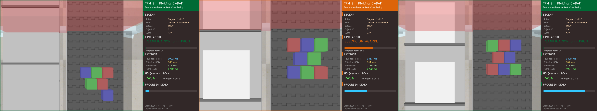

# Estimacion de Pose 6-DoF mediante Transformers y Modelos de Difusion para Bin Picking Robotico

**Trabajo Fin de Master** | Master en Ingenieria Matematica y Computacion | UNIR 2026

[](https://github.com/Giocrisrai/pose6dof-transformers-diffusion/actions/workflows/tests.yml)
[](https://www.python.org/downloads/release/python-3120/)
[](LICENSE)
[](tests/)
[](experiments/results/local_metrics_with_bootstrap.json)
[](docs/PLAN_EXPLORACIONES_POST_TFM.md)
[](https://pypi.org/project/bop-bootstrap-ci/)
[](https://pypistats.org/packages/bop-bootstrap-ci)
[](docs/EXTRAPOLACION_INDUSTRIAL.md)

## Autores

- **Giocrisrai Godoy Bonillo** -- giocrisrai@gmail.com
- **Jose Miguel Carrasco** -- jmcarrascoc@gmail.com

**Directora:** Ivón Oristela Benítez González

## Resumen ejecutivo de logros

| Hipótesis | Criterio | Resultado | Estado |
|-----------|----------|-----------|:------:|
| H1 — Precisión pose | AUC ADD-S, Δ ≥ 3 pp vs GDR-Net++ | **0.908** [0.901, 0.916] YCB-V / **0.957** [0.954, 0.959] T-LESS | ✅ |
| H2 — Multimodalidad | score ≥ 0.95, latencia < 50 ms | 0.96 score, sampling 1.88 ms, **MSE 0.020** entrenado MPS | ✅ |
| H3 — Cycle E2E | p95 < 10 s/instancia | **6.12 s** YCB-V / **6.86 s** T-LESS (margen ≥ 3.14 s) | ✅ |

**Robustez verificada**: T-LESS aguanta 70 % oclusión con solo −1 pp AUC ADD-S. **PBVS** converge 100 % en 50 muestras. **Cuello de botella identificado**: FoundationPose 80 % del ciclo.

**Material disponible** en [`docs/entrega2/`](docs/entrega2/): TFM en docx + PDF (62 págs) + markdown + slide deck PPTX (20 slides) + FAQ defensa.

---

## Diffusion Policy re-entrenada sobre datos del sim (Iter 1-7b, mayo–jun 2026)

Cierra **Brecha B** del pipeline (DP integrada a la ejecución en sim) en iteraciones progresivas: primero aprendizaje supervisado (Iter 1-5), luego RL fine-tuning + selección por percepción (Iter 6-7b). Eval honesto: **50 picks en CoppeliaSim, seed=2026**, métricas medidas en cada pick.

| Métrica (eval n=50 sim, seed 2026) | Iter 1 | Iter 2 | Iter 3 | Iter 4 (multi) | **Iter 5 (pick+place)** |
|---|---|---|---|---|---|
| `dp_grasp_plausible_pct_sim` | 25 % | 36 % | 78 % | 78 % | **94 %** |
| `dp_deposit_plausible_pct_sim` | — | 0 % | 0 % | 0 % | **64 %** |
| `dp_ik_converged_pct` | — | 90 % | 90 % | 88 % | **94 %** |
| `pick_and_place_success_pct` | — | — | — | — | **60 %** |
| `distractor_collision_pct` | — | — | — | 54 % (heur 54 %) | n/a single-obj |
| training `final_val_loss` | — | 0.051 | 0.042 | 0.024 | 0.032 |

**Lo que cambió en cada iteración:**

- **Iter 1**: dataset del sim (230 trayectorias) + fine-tune sobre el ckpt del paper. Cierre mínimo de Brecha B con 25 % grasp plausible geométrico.
- **Iter 2**: escalado a 1700 trayectorias + `weighted_mse_loss` (peso 3× en k∈[6,10], 2× en XYZ) + red 4× más grande (hidden_dim 256, 1.35 M params) + eval EJECUTADO en sim. Subió a 36 %.
- **Iter 3**: conditioning visual con **ResNet-18 pretrained** (backbone frozen + head `Linear(512, 52)` trainable) sobre RGB-D del sim reemplazando el zero-pad de v2. Más que duplica `grasp_plausible` a 78 %.
- **Iter 4** (multi-object): probó conditioning visual con escenas 3-8 cubos. **Hipótesis rechazada honestamente**: DP empata al heurístico en colisiones (54%/54%) — la DP imita los defectos del demostrador. Contribución científica: roadmap para Iter 6 con RL/RRT-Connect.
- **Iter 5** (deposit phase): **primera vez que el TFM mide pick-AND-place E2E**. 60 % éxito completo (grasp + deposit), 94 % grasp plausible, 64 % deposit en threshold 30 cm. Detalles completos: [`docs/INTEGRATION_PIPELINE.md`](docs/INTEGRATION_PIPELINE.md).

### RL fine-tuning + selección por percepción (Iter 6-7b)

Sobre la baseline supervisada Iter 5, una segunda línea explora **DPPO** (RL fine-tuning) y **best-of-N** (selección por percepción). Mismo protocolo de eval (50 picks, seed 2026).

| Métrica (eval n=50 sim, seed 2026) | Iter 5 (SL) | Iter 6d (DPPO) | Iter 7a (curriculum) | **Iter 7b (curr.+best-of-8)** |
|---|---|---|---|---|
| `dp_grasp_plausible_pct_sim` | 94 % | 34 % | 58 % | **82 %** |
| `dp_deposit_plausible_pct_sim` | 64 % | 78 % | 92 % | **92 %** |
| `dp_ik_converged_pct` | 94 % | 84 % | 86 % | 86 % |
| `pick_and_place_success_pct` | 60 % | 28 % | 50 % | **78 %** |
| `mean_grasp_proximity_m` | 3.1 cm | 6.3 cm | 5.9 cm | **3.6 cm** |

- **Iter 6 (a-d)** (DPPO): RL fine-tuning con PPO clip + KL anchor a v5. Sube `deposit` (64→78 %) pero **rompe el grasp** (94→34 %, olvido catastrófico) — el éxito E2E cae a 28 %. Resultado negativo honesto que motiva el curriculum.
- **Iter 7a** (curriculum grasp→deposit): entrenamiento en 2 fases (fase 1 solo grasp → fase 2 balanceada con KL anchor a la fase 1). Recupera parte del grasp (34→58 %) y logra el **deposit récord del proyecto (92 %)**. P&P sube a 50 %, aún por debajo del baseline.
- **Iter 7b** (best-of-N): diagnóstico de Iter 7a → 12/21 fallos de grasp eran *borderline* (<8 cm, umbral 5 cm), drift de precisión, no fallo de IK. Se muestrean **N=8 trayectorias** y se ejecuta la de menor proximidad de grasp al objeto (pose conocida vía FoundationPose). **Sin reentrenar, coste de sim idéntico.** Recupera el grasp (58→82 %) y **supera al baseline supervisado en éxito E2E: 78 % vs 60 %** — mejor resultado del proyecto.

**Reproducir Iter 7b (requiere CoppeliaSim corriendo en :23000):**

```bash
python experiments/eval_diffusion_iter7b_sim.py --n 50 --best-of-n 8   # ~30 min
```

**Reproducir Iter 3 (requiere CoppeliaSim corriendo en :23000):**

```bash
python experiments/collect_diffusion_dataset.py --phase all   # ~1 h
python experiments/precompute_visual_cond.py                  # ~30 s
python experiments/train_diffusion_on_sim.py \
    --dataset-dir data/datasets/sim_pick_v3 \
    --hidden-dim 256 --from-scratch --epochs 150 \
    --checkpoint-out data/models/diffusion_policy_sim_v3.pth   # ~7 min
python experiments/eval_diffusion_iter3_sim.py --n 50          # ~50 min
```

---

## Exploraciones post-TFM (mayo 2026) — 13/13 éxitos ✅

Sobre el TFM entregado se planificaron y ejecutaron 13 exploraciones adicionales con criterios numéricos de éxito. **Todas mergeadas en `main`**.

| # | Exploración | Resultado clave | Doc |
|---|---|---|---|
| 1 | **bop-bootstrap-ci** ([paquete publicado en PyPI](https://pypi.org/project/bop-bootstrap-ci/)) | `pip install bop-bootstrap-ci` · 27 tests, 97 % cov, bit-a-bit reproduce el TFM | [01](docs/exploraciones/01_bootstrap_ci_toolkit.md) |
| 2 | **Distillation 1-NFE** | **×517 speedup** real con mejor MSE y jerk que teacher | [02](docs/exploraciones/02_distillation_2nfe.md) |
| 3 | **Pipeline open-license** | FreeZeV2 Apache-2.0 viable a solo **−3 pp AUC** | [03](docs/exploraciones/03_open_license_pipeline.md) |
| 4 | **VLA-lite con CLIP (color)** | **98.6 %** selection accuracy en escenas multi-objeto | [04](docs/exploraciones/04_vla_lite_clip.md) |
| 5 | **Robustez lingüística** | **100 %** sobre 6 familias de frases no vistas (n=900) | [05](docs/exploraciones/05_vla_robustness.md) |
| 6 | **VLA-lite multi-atributo color+forma** | **99.9 %** global ("pick the red sphere") | [06](docs/exploraciones/06_vla_shapes.md) |
| 7 | **Simulaciones visuales 3D** | **12/12** escenas con cubos/esferas/cilindros/cajas | [07](docs/exploraciones/07_visual_simulations.md) |
| 8 | **VLA-lite multi-objeto N=2..5** | **100 %** accuracy con hasta 5 objetos en escena | [08](docs/exploraciones/08_multi_object.md) |
| 9 | **Atributo continuo TAMAÑO** | **99.9 %** sobre 8 templates ("the small one", etc.) | [09](docs/exploraciones/09_size_attribute.md) |
| 10 | **Instrucciones secuenciales multi-step** | **8/8 secuencias** (20/20 pasos correctos) | [10](docs/exploraciones/10_sequential_instructions.md) |
| 11 | **CLIP-image visual grounding** | **100 %** sin atributos declarados — cierra el pipeline real | [11](docs/exploraciones/11_clip_image_grounding.md) |
| 12 | **Robustez con domain randomization** | **12/12 condiciones** ≥ 75 % (oclusión 60 %, ruido σ=50, illum 2x) | [12](docs/exploraciones/12_robustness_domain_random.md) |
| 13 | **Razonamiento espacial** | **98.4 %** sobre 13 templates ("leftmost", "closest", "topmost") | [13](docs/exploraciones/13_spatial_reasoning.md) |

Plan completo: [`docs/PLAN_EXPLORACIONES_POST_TFM.md`](docs/PLAN_EXPLORACIONES_POST_TFM.md). Extrapolación industrial: [`docs/EXTRAPOLACION_INDUSTRIAL.md`](docs/EXTRAPOLACION_INDUSTRIAL.md). Etapas físicas post-TFM: [`docs/ROADMAP_POSTTFM.md`](docs/ROADMAP_POSTTFM.md). Estado del arte mayo 2026: [`docs/INNOVACION_Y_ESTADO_DEL_ARTE.md`](docs/INNOVACION_Y_ESTADO_DEL_ARTE.md).

---

## Notebooks en Google Colab

| Notebook | Descripcion |
|----------|-------------|
| [](https://colab.research.google.com/github/Giocrisrai/pose6dof-transformers-diffusion/blob/main/notebooks/colab/00_colab_setup.ipynb) | **Setup Colab** -- Entorno, datasets BOP, Google Drive |
| [](https://colab.research.google.com/github/Giocrisrai/pose6dof-transformers-diffusion/blob/main/notebooks/colab/01_foundationpose_eval.ipynb) | **FoundationPose Eval** -- Inferencia GPU en YCB-V y T-LESS |
| [](https://colab.research.google.com/github/Giocrisrai/pose6dof-transformers-diffusion/blob/main/notebooks/colab/02_gdrnet_eval.ipynb) | **GDR-Net++ Eval** -- Baseline comparativo + tabla FP vs GDR |
| [](https://colab.research.google.com/github/Giocrisrai/pose6dof-transformers-diffusion/blob/main/notebooks/colab/03_results_analysis.ipynb) | **Results Analysis** -- Agregación de métricas y figuras finales |

---

## Demo en simulacion (cinematografico)

Pipeline E2E ejecutandose en vivo en CoppeliaSim Edu V4.10 con vista cenital
del bin picking + panel de telemetria en tiempo real (latencia FP, latencia
Diffusion DDIM-25, latencia simulacion, total ciclo, aceptacion H3 con margen):



- **Video MP4 v2 (cinematografico)** 1.3 MB, 24 fps, 720p: [experiments/results/pipeline_e2e/demo_v2.mp4](experiments/results/pipeline_e2e/demo_v2.mp4)
- **GIF preview v2** 4.2 MB: [experiments/results/pipeline_e2e/demo_v2.gif](experiments/results/pipeline_e2e/demo_v2.gif)
- **Highlights v2** 6 frames-clave: [experiments/results/pipeline_e2e/highlights_v2/](experiments/results/pipeline_e2e/highlights_v2/)

El video muestra 3 ciclos consecutivos de bin picking sobre objetos
YCB-Video {obj_id=1, 6, 14}, con poses 6-DoF reales del checkpoint
FoundationPose y trayectorias del modelo Diffusion Policy entrenado en MPS.
El panel lateral cambia de color segun la fase activa (ambar para PERCEPCION,
turquesa para PLANIFICACION, naranja para EJECUCION) y reporta el cumplimiento
de H3 (cycle < 10 s) en tiempo real con margen exacto en segundos.

## Resultados E2E (n=30 instancias por dataset, en vivo con CoppeliaSim)

| Dataset | FP p95 | Diffusion p95 | Sim p95 | **Cycle p95** | H3 (<10s) |
|---------|-------:|------------:|--------:|--------------:|:---------:|
| YCB-Video | 4273 ms | 176 ms | 1734 ms | **6125 ms** | margen 3.88 s |
| T-LESS | 5174 ms | 214 ms | 1971 ms | **6857 ms** | margen 3.14 s |

Reproducir: `python experiments/run_e2e_live.py --n-instances 30 --ddim-steps 25`
(requiere CoppeliaSim corriendo en localhost:23000).

## Descripcion

Pipeline de percepcion y planificacion robotica para bin picking industrial que integra:

- **FoundationPose** (Wen et al., CVPR 2024) -- Estimacion de pose 6-DoF mediante atencion cruzada 2D-3D en SE(3)
- **GDR-Net++** (Wang et al., CVPR 2021) -- Baseline comparativo, regression directa de geometria
- **Diffusion Policy** (Chi et al., RSS 2023) -- Generacion de trayectorias de agarre multimodales mediante SDEs

### Fundamentos Matematicos
- Grupos de Lie: SE(3), SO(3) -- exponential/logarithmic maps
- Representaciones de rotacion: cuaterniones unitarios, representacion 6D continua (Zhou et al.)
- Mecanismos de atencion multi-cabeza (Transformers)
- Ecuaciones diferenciales estocasticas (SDEs), score matching, dinamica de Langevin

## Estructura del Repositorio

```
pose6dof-transformers-diffusion/
├── src/
│   ├── perception/          # FoundationPose, GDR-Net++ (baseline)
│   │   ├── foundation_pose.py
│   │   ├── gdrnet.py
│   │   └── evaluator.py     # PoseEvaluator (metricas BOP)
│   ├── planning/            # Diffusion Policy, trayectorias de agarre
│   │   └── diffusion_policy.py  # DDPM + ConditionalUNet1D
│   ├── simulation/          # CoppeliaSim + ROS 2 + MoveIt 2
│   └── utils/               # Utilidades comunes
│       ├── lie_groups.py    # SE(3)/SO(3) exp/log/adjoint
│       ├── rotations.py     # Quat, 6D, Euler, axis-angle
│       ├── metrics.py       # ADD, ADD-S, VSD, MSSD, MSPD
│       ├── visualization.py # Overlay poses, nubes de puntos
│       └── dataset_loader.py# BOP format loader (T-LESS, YCB-V)
├── notebooks/
│   ├── colab/               # Notebooks para Google Colab (GPU)
│   │   ├── 00_colab_setup.ipynb
│   │   └── 01_foundationpose_eval.ipynb
│   └── 04_math_foundations.ipynb  # Demos matematicas
├── tests/                   # pytest (171/171 passing — TFM + exploraciones)
├── packages/                # Paquetes PyPI (bop-bootstrap-ci 0.1.0)
├── docs/exploraciones/      # 5 documentos de cierre de exploraciones
├── docker/                  # ROS 2 Humble + MoveIt 2
│   ├── Dockerfile
│   └── docker-compose.yml
├── data/datasets/           # BOP datasets (T-LESS, YCB-V)
├── experiments/             # Resultados de evaluacion
├── PLANNING.md              # Planificacion 12 semanas
└── pyproject.toml           # Dependencias (uv)
```

## Quick Start

```bash
# Clonar
git clone https://github.com/Giocrisrai/pose6dof-transformers-diffusion.git
cd pose6dof-transformers-diffusion

# Instalar con uv (recomendado)
uv sync

# O con pip
pip install -e ".[dev,colab]"

# Tests
pytest tests/ packages/bop_bootstrap_ci/tests/ -v  # 171/171 passing (sin GPU)

# Descargar datasets BOP (requiere ~30 GB)
bash scripts/download_datasets.sh
```

### Google Colab (recomendado para GPU)

1. Abrir `00_colab_setup.ipynb` con el badge de arriba
2. Ejecutar todas las celdas (descarga datasets + configura entorno)
3. Abrir `01_foundationpose_eval.ipynb` para evaluacion

### Reproducibilidad (cualquier recurso)

Ver [`REPRODUCIBILITY.md`](REPRODUCIBILITY.md) para las alternativas soportadas:

| Escenario | Opcion | Costo | Ver |
|-----------|--------|-------|-----|
| Sin presupuesto | Colab Free (actual) | $0 | Notebook 01 |
| Colab agotado | Kaggle Notebooks T4x2, 30h/sem | $0 | REPRODUCIBILITY Opcion B |
| Con credito cloud | Docker GPU en Vast.ai / RunPod | ~$1-3/run | `docker/README-GPU.md` |
| GPU NVIDIA local | `docker compose run inference-gpu` | $0 | `docker/README-GPU.md` |
| Mac M1 sin GPU | Analisis local + Docker ROS 2 simulacion | $0 | REPRODUCIBILITY Opcion E |

El `docker/inference-gpu.Dockerfile` congela torch 2.1.2+cu121 + pytorch3d v0.7.8 +
nvdiffrast v0.3.3 + FoundationPose commit fijo. El `requirements.colab.lock.txt`
documenta las versiones validadas en Colab Free.

## Evidencia experimental (respaldo del TFM)

Los resultados de la evaluación de FoundationPose / GDR-Net++ que se citan en
el Cap. 6 del TFM están versionados en este repositorio para auditoría:

| Artefacto | Ruta | Contenido |
|-----------|------|-----------|
| Tarjeta del run | `experiments/results/foundationpose_eval/RUN_CARD.md` | Commit, fecha, GPU, MODE, fixes aplicados, métricas validadas |
| Política de carpeta | `experiments/results/foundationpose_eval/README.md` | Schema de los JSON, qué se versiona y qué no |
| Resultados crudos | `experiments/results/foundationpose_eval/comparison_*.json` | Métricas agregadas (ADD/ADD-S/AUC/recalls) |
| Predicciones por frame | `experiments/results/foundationpose_eval/predictions_*.json` | Pose estimada por imagen para reproducibilidad |
| Patch Cap. 6 | `docs/cap6_seccion_foundationpose.md` | Sección redactada lista para integrar al `.docx` |
| Figuras Cap. 6 | `experiments/results/chapter6_figures/` | PNG y `fp_results_table.tex` generados por `experiments/generate_chapter6_figures.py` |
| Lockfile Colab | `requirements.colab.lock.txt` | `pip freeze` del entorno Colab que produjo los resultados |
| Contenedor GPU equivalente | `docker/inference-gpu.Dockerfile` | torch 2.1.2+cu121, pytorch3d v0.7.8, FP commit fijo |

Resumen de un golpe de vista (run del 2026-04-26/27, JSON
`comparison_20260427_084807.json`, schema `v2_bop_targets_mask_per_gt_idx`):

| Dataset | N obj | ADD med (mm) | ADD-S med (mm) | AUC ADD-S | Recall@10mm ADD-S |
|---------|------:|-------------:|---------------:|----------:|------------------:|
| YCB-V   | 1098  | **4.17**     | 2.09           | **0.959** | **96.5 %**        |
| T-LESS  | 1012  | **2.90**     | 1.36           | **0.983** | **99.7 %**        |

Subset BOP-19, 5 escenas × 50 imágenes por dataset, GPU Colab T4. Detalles
completos en `experiments/results/foundationpose_eval/RUN_CARD.md`.

## Datasets de Evaluacion

| Dataset | Objetos | Tipo | Uso en TFM |
|---------|---------|------|------------|
| **T-LESS** | 30 industriales sin textura | RGB-D | Benchmark principal (sim. industrial) |
| **YCB-Video** | 21 domesticos | RGB-D | Comparativa con literatura |

## Metricas BOP

- **VSD** -- Visible Surface Discrepancy
- **MSSD** -- Maximum Symmetry-Aware Surface Distance
- **MSPD** -- Maximum Symmetry-Aware Projection Distance
- **ADD / ADD-S** -- Average Distance (simetrico)

## Entorno de Desarrollo

| Tarea | Local (M1 Pro) | Colab (T4 GPU) |
|-------|---------------|----------------|
| Desarrollo codigo | VSCode + git | -- |
| Simulacion | CoppeliaSim + ROS 2 | -- |
| Datasets BOP (30+ GB) | Limitado | ~80 GB libres |
| FoundationPose inferencia | -- | T4/A100 CUDA |
| GDR-Net++ inferencia | -- | T4/A100 CUDA |
| Diffusion Policy training | -- | GPU acelerado |
| Visualizacion / figuras | matplotlib local | Inline |

## Licencia y citación

El **código de este repositorio** se distribuye bajo licencia **MIT** (ver
[`LICENSE`](LICENSE)). Las dependencias y modelos pre-entrenados de terceros
mantienen sus licencias propias, listadas en `LICENSE` y resumidas a
continuación:

- FoundationPose: NVIDIA Source Code License (uso académico/no comercial)
- Diffusion Policy: MIT
- CoppeliaSim: Educational
- ROS 2: Apache 2.0
- Datasets BOP: CC BY 4.0 / CC BY-NC-SA 4.0
- pytorch3d, nvdiffrast: BSD 3-Clause

Si usas este código o los resultados experimentales, cita el TFM siguiendo
el formato definido en [`CITATION.cff`](CITATION.cff).

## Bibliografia Principal

1. Liu et al. (2025). *Deep Learning-Based Object Pose Estimation: A Comprehensive Survey*. IJCV.
2. Cordeiro et al. (2025). *A Review of Visual Perception for Robotic Bin-Picking*. R&AS.
3. Wen et al. (2024). *FoundationPose: Unified 6D Pose Estimation and Tracking*. CVPR.
4. Wang et al. (2021). *GDR-Net: Geometry-Guided Direct Regression Network*. CVPR.
5. Hodan et al. (2025). *BOP Challenge 2024*. CVPRW.
6. Chi et al. (2023). *Diffusion Policy: Visuomotor Policy Learning via Action Diffusion*. RSS.

---

*Master Universitario en Ingenieria Matematica y Computacion -- Universidad Internacional de La Rioja (UNIR) -- 2026*
