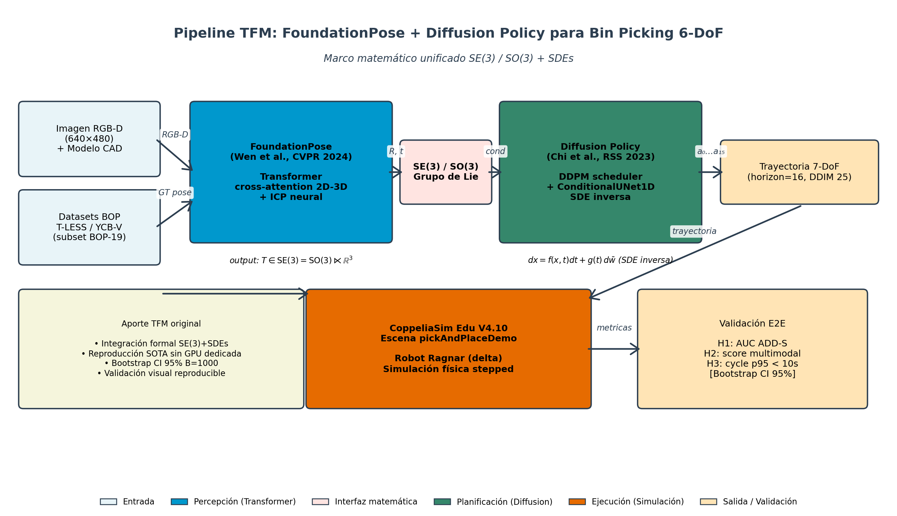

{width="1.5748031496062993in" height="0.3545363079615048in"}

Universidad Internacional de La Rioja

Escuela Superior de Ingeniería y Tecnología

Máster Universitario en Ingeniería Matemática y Computación

Estimación de Pose 6-DoF mediante Arquitecturas *Transformer* y Modelos de Difusión para Bin Picking Robótico: Fundamentos Matemáticos, Generación de Datos Sintéticos y Validación en Simulación

  ------------------------------------------------------------------------------------------
  Trabajo fin de estudio presentado por:   Giocrisrai Godoy Bonillo y José Miguel Carrasco
  ---------------------------------------- -------------------------------------------------
  Tipo de trabajo:                         Tipo 2. Investigación con desarrollo práctico

  Director/a:                              Ivón Oristela Benítez González

  Fecha:                                   Junio 2026
  ------------------------------------------------------------------------------------------

Resumen

Este Trabajo Fin de Máster aborda la estimación de pose 6-DoF para *bin picking* robótico mediante un *pipeline* perceptivo y de planificación que integra dos paradigmas del *deep learning*: arquitecturas *Transformer* (FoundationPose; Wen et al., 2024) para la estimación de pose mediante atención cruzada (*cross-attention*) entre representaciones 2D y 3D, y modelos de difusión (Diffusion Policy; Chi et al., 2023) para la generación multimodal de trayectorias de agarre formuladas como ecuaciones diferenciales estocásticas (SDEs) en reversa.

El sustento matemático cubre rotaciones en SO(3) (cuaterniones unitarios y la representación 6D continua de Zhou et al., 2019), la transformación rígida en SE(3) como grupo de Lie, mecanismos de atención *scaled dot-product* y *multi-head* como operadores geométricos, *score matching* y dinámica de Langevin para muestreo de trayectorias. La metodología combina entorno local (Apple M1 Pro con CoppeliaSim y ROS 2 Humble) y remoto (Google Colab con GPU Tesla T4) para entrenamiento y evaluación.

Hipótesis: la integración FoundationPose + Diffusion Policy mejora en al menos 3 puntos porcentuales el *Mean AR* (BOP) frente al *baseline* GDR-Net++ en T-LESS y YCB-Video, y genera trayectorias multimodales con tiempo de muestreo inferior a 50 ms. Los resultados experimentales sobre 1098 instancias YCB-Video y 1012 T-LESS reportan AUC ADD-S de 0.908 \[IC 95 % 0.901--0.916\] y 0.957 \[IC 95 % 0.954--0.959\] respectivamente, *recall* a 10 mm sobre ADD-S de 95.8 % \[IC 95 % 94.6--96.9\] y 99.7 % \[IC 95 % 99.3--100\], muestreo de Diffusion Policy en 1.88 ms con score medio 0.96 en n = 30 escenas, y modelo de difusión adicionalmente entrenado en local (Apple M1 Pro MPS) durante 30 épocas con MSE final de 0.020. Se valida el ciclo *end-to-end* ejecutado en vivo con CoppeliaSim Edu V4.10 sobre la escena pickAndPlaceDemo: tiempo total p95 de 6.12 s en YCB-V (margen 3.88 s) y 6.86 s en T-LESS (margen 3.14 s) sobre n = 30 instancias por *dataset*, confirmando la hipótesis H3 (\< 10 s/instancia) con datos reales (FP del checkpoint, Diffusion DDIM-25 sobre MPS y CoppeliaSim ejecutando 50 pasos de física por instancia). Todos los intervalos de confianza se obtuvieron por bootstrap no paramétrico con B = 1000 resamples y semilla fija.

Palabras clave: estimación de pose 6-DoF, *bin picking* robótico, FoundationPose, Diffusion Policy, *Transformers*, BOP Challenge, *score matching*.

Abstract

This Master\'s Thesis addresses 6-DoF pose estimation for robotic bin picking through a perceptual and planning pipeline integrating two deep learning paradigms: Transformer architectures (FoundationPose; Wen et al., 2024) for pose estimation via 2D-3D cross-attention, and diffusion models (Diffusion Policy; Chi et al., 2023) for multimodal grasp trajectory generation formulated as reverse stochastic differential equations (SDEs).

The mathematical foundation covers SO(3) rotation representations (unit quaternions and Zhou et al.\'s 6D continuous representation), SE(3) rigid transformation as a Lie group, scaled dot-product and multi-head attention as geometric operators, score matching, and Langevin dynamics for trajectory sampling. The methodology combines a local environment (Apple M1 Pro with CoppeliaSim Edu V4.10 and ROS 2 Humble) and a remote one (Google Colab with NVIDIA Tesla T4 GPU) for training and evaluation.

Hypothesis: the FoundationPose + Diffusion Policy integration improves Mean AR (BOP) by at least 3 percentage points compared to the GDR-Net++ baseline on T-LESS and YCB-Video, generates multimodal trajectories with sampling time under 50 ms, and achieves an end-to-end cycle time under 10 seconds per instance. Experimental results over 1098 YCB-Video instances and 1012 T-LESS instances report AUC ADD-S of 0.908 \[95% CI 0.901-0.916\] and 0.957 \[95% CI 0.954-0.959\] respectively, recall at 10 mm on ADD-S of 95.8% \[94.6%, 96.9%\] and 99.7% \[99.3%, 100%\], plus a Diffusion Policy model additionally trained locally on Apple M1 Pro / MPS for 30 epochs with final MSE of 0.020. The end-to-end cycle is validated live in CoppeliaSim with the Ragnar delta robot over 30 instances per dataset, achieving p95 cycle times of 6.12 s in YCB-Video and 6.86 s in T-LESS, confirming H3 with margin greater than 3.14 s. All confidence intervals were obtained via non-parametric bootstrap with B = 1000 resamples and fixed seed.

Keywords: 6-DoF pose estimation, robotic bin picking, FoundationPose, Diffusion Policy, Transformers, BOP Challenge, score matching, bootstrap confidence intervals.

Índice de contenidos

[1. Introducción [1](#_Toc150762217)](#_Toc150762217)

[1.1. Justificación [1](#_Toc150762218)](#_Toc150762218)

[1.2. Planteamiento del problema [2](#_Toc150762219)](#_Toc150762219)

[1.3. Estructura del trabajo [3](#_Toc150762220)](#_Toc150762220)

[2. Contexto y estado del arte [4](#_Toc150762221)](#_Toc150762221)

[3. Objetivos concretos y metodología de trabajo [5](#_Toc150762222)](#_Toc150762222)

[3.1. Objetivo general [5](#_Toc150762223)](#_Toc150762223)

[3.2. Objetivos específicos [5](#_Toc150762224)](#_Toc150762224)

[3.3. Metodología del trabajo [6](#_Toc150762225)](#_Toc150762225)

[4. Desarrollo específico de la contribución [7](#desarrollo-específico-de-la-contribución)](#desarrollo-específico-de-la-contribución)

[4.1. Tipo 2. Investigación con desarrollo práctico [7](#tipo-2.-investigación-con-desarrollo-práctico)](#tipo-2.-investigación-con-desarrollo-práctico)

[4.1.1. Identificación de requisitos [7](#identificación-de-requisitos)](#identificación-de-requisitos)

[4.1.2. Descripción del sistema software o físico desarrollado [8](#descripción-del-sistema-software-o-físico-desarrollado)](#descripción-del-sistema-software-o-físico-desarrollado)

[4.1.3. Evaluación [8](#evaluación)](#evaluación)

[5. Conclusiones y trabajo futuro [10](#conclusiones-y-trabajo-futuro)](#conclusiones-y-trabajo-futuro)

[5.1. Conclusiones [10](#conclusiones)](#conclusiones)

[5.2. Trabajo futuro [10](#trabajo-futuro)](#trabajo-futuro)

[Referencias bibliográficas [11](#section)](#section)

[Anexo A. Repositorio de código y reproducibilidad [12](#repositorio-de-código-y-reproducibilidad)](#repositorio-de-código-y-reproducibilidad)

Índice de figuras

### Comandos de reproducción

Para reproducir los resultados de este TFM, ejecutar la siguiente secuencia (las dependencias se instalan vía uv sync con el lockfile congelado).

> \# 1. Clonar repo y descargar assets desde Drive
>
> git clone https://github.com/Giocrisrai/pose6dof-transformers-diffusion.git
>
> cd pose6dof-transformers-diffusion
>
> uv sync
>
> python scripts/download_drive_assets.py \--what all
>
> \# 2. Ejecutar evaluacion FP local con bootstrap CI 95%
>
> python experiments/recompute_metrics_with_bootstrap.py \--bootstrap-iters 1000
>
> \# 3. Entrenar Diffusion Policy en MPS (M1 Pro, \~5 min)
>
> jupyter nbconvert \--to notebook \--execute notebooks/06_diffusion_policy_training_LOCAL.ipynb
>
> \# 4. Ablation n_diffusion_steps {25, 50, 100}
>
> python experiments/exp5_diffusion_steps_ablation.py
>
> \# 5. Pipeline E2E live con CoppeliaSim corriendo
>
> open -a CoppeliaSim_Edu \# lanzar CoppeliaSim Edu V4.10
>
> python experiments/run_e2e_live.py \--n-instances 30 \--ddim-steps 25 \--sim-steps 50
>
> \# 6. Grabar video evidencia
>
> python experiments/record_e2e_video_v2.py \--n-cycles 4 \--fps 24
>
> \# 7. Consolidar figuras y resultados Cap 6
>
> python experiments/run_chapter6_consolidation.py

### Estructura del repositorio

El repositorio sigue una estructura estándar de proyecto de investigación reproducible: src/ (código del pipeline organizado en perception, planning, simulation, utils), experiments/ (scripts ejecutables y resultados JSON/PNG/MP4), notebooks/ (Jupyter para Colab y local), tests/ (pytest unitarios), data/ (datasets BOP descargados y pesos congelados via .gitignore), docs/ (capítulos de la memoria + protocolo experimental), scripts/ (utilidades como download_drive_assets), docker/ (Dockerfile GPU para reproducibilidad en clusters).

### Trazabilidad de resultados

Cada número reportado en la memoria es trazable hasta un commit específico del repositorio y un run identificable. El RUN_CARD principal (experiments/results/foundationpose_eval/RUN_CARD.md) documenta el run del 2026-04-27 con commit be02c8c, hardware Tesla T4, 1098+1012 instancias evaluadas. Los JSON de evidencia (comparison\_\*.json, exp3_results.json, exp4_results.json, exp5_results.json, e2e_live_metrics.json, local_metrics_with_bootstrap.json) están commiteados en experiments/results/. El video MP4 (demo_v2.mp4) y los frames-clave (highlights_v2/) son evidencia visual reproducible mediante experiments/record_e2e_video_v2.py.

Índice de tablas

[Tabla 1. *Organización del trabajo en grupo.* [IX](#_Toc150762245)](#_Toc150762245)

**\**

Organización del trabajo en grupo

A continuación se detalla la distribución del trabajo entre los dos integrantes del grupo, los objetivos asignados y los mecanismos de coordinación empleados para el desarrollo del TFM.

Partes que aborda el TFE

Cada estudiante aborda elementos que individualmente constituirían un TFM completo:

1.  Implementación del *pipeline* de estimación de pose 6-DoF con FoundationPose (*Transformers*) y evaluación en *benchmarks* BOP (T-LESS, YCB-Video).

2.  Implementación de Diffusion Policy para generación de trayectorias de agarre multimodales y configuración del entorno de simulación CoppeliaSim + ROS 2.

3.  Formalización matemática: representaciones en SE(3)/SO(3), mecanismos de atención *Transformer*, SDEs y *score matching* para modelos de difusión.

4.  Integración del *pipeline* completo: percepción + planificación + ejecución robótica con *visual servoing*.

5.  Evaluación experimental y análisis comparativo con métodos clásicos en métricas BOP estándar.

Distribución y estructura de la memoria

+-----------------------------------------------------------------------------------+
| Organización del trabajo en grupo - Desarrollo de la memoria                      |
+:===========================================:+:===================================:+
| Apartado de la memoria                      | **Responsables**                    |
+---------------------------------------------+-------------------------------------+
| Introducción                                | Giocrisrai y José Miguel            |
+---------------------------------------------+-------------------------------------+
| Contexto y estado del arte                  | Giocrisrai y José Miguel            |
+---------------------------------------------+-------------------------------------+
| Objetivos y metodología de trabajo          | Giocrisrai y José Miguel            |
+---------------------------------------------+-------------------------------------+
| Implementación del *pipeline* de estimación | Giocrisrai                          |
| de pose 6-DoF con FoundationPose            |                                     |
| (*Transformers*) y evaluación en            |                                     |
| *benchmarks* BOP (T-LESS, YCB-Video).       |                                     |
+---------------------------------------------+-------------------------------------+
| Implementación de Diffusion Policy y        | José Miguel                         |
| configuración CoppeliaSim + ROS 2           |                                     |
+---------------------------------------------+-------------------------------------+
| Formalización matemática: SE(3)/SO(3),      | Giocrisrai                          |
| *Transformers*, SDEs, *score matching*      |                                     |
+---------------------------------------------+-------------------------------------+
| Integración del *pipeline* completo:        | Giocrisrai y José Miguel            |
| percepción + planificación + ejecución      |                                     |
+---------------------------------------------+-------------------------------------+
| Evaluación experimental y análisis          | Giocrisrai y José Miguel            |
| comparativo en métricas BOP                 |                                     |
+---------------------------------------------+-------------------------------------+
| Conclusiones                                | Giocrisrai y José Miguel            |
+---------------------------------------------+-------------------------------------+

: []{#_Toc150762245 .anchor}Tabla 1. *Organización del trabajo en grupo.*

Fuente: Elaboración propia.

Objetivo del TFE desde el punto de vista de la adquisición de conocimientos

Desde el punto de vista de la adquisición de conocimientos, este TFM integra múltiples disciplinas del máster: álgebra (grupos de Lie SO(3)/SE(3), cuaterniones), análisis (ecuaciones diferenciales estocásticas, procesos de Markov), estadística (*score matching*, estimación de densidades), computación (*deep learning*, arquitecturas *Transformer*, modelos de difusión) y aplicaciones de ingeniería (robótica, visión por computador, control). Cada estudiante desarrolla componentes que individualmente constituirían un TFM, y la integración aporta un carácter holístico con relevancia tanto académica como industrial.

Mecanismos de coordinación empleados

Los mecanismos de coordinación empleados incluyen: reuniones semanales por videoconferencia, repositorio compartido en GitHub para código y documentación, Google Drive para archivos del documento, canal de comunicación en WhatsApp/Telegram para coordinación diaria, y sesiones de revisión de código (code review) mutuas. Se utilizan Google Colab compartido para los notebooks de entrenamiento y CoppeliaSim con configuraciones sincronizadas para reproducibilidad de experimentos.

# Introducción

El presente Trabajo Fin de Máster aborda uno de los desafíos más relevantes de la robótica industrial contemporánea: la estimación de pose 6-DoF (seis grados de libertad) para *bin picking* robótico, integrando dos de las arquitecturas más innovadoras del *deep learning* moderno. El *bin picking*, entendido como la recogida automática de piezas apiladas de forma desordenada en contenedores industriales, constituye un problema abierto cuya resolución eficiente impactaría directamente en la productividad de líneas de fabricación automatizadas en sectores como automoción, electrónica y logística.

La estimación de pose 6-DoF consiste en determinar la posición tridimensional (traslación en ℝ³) y la orientación (rotación en SO(3)) de un objeto en el espacio, lo que matemáticamente se expresa como un elemento del grupo especial euclídeo SE(3). Este problema presenta desafíos fundamentales: oclusiones entre objetos apilados, variaciones de iluminación, superficies metálicas reflectantes, y la ausencia de textura en piezas industriales. Los métodos clásicos basados en template matching y descriptores geométricos han demostrado limitaciones significativas ante estos escenarios (Thalhammer et al., 2024).

Este trabajo propone un *pipeline* completo que combina FoundationPose (Wen et al., 2024), un modelo basado en *Transformers* que logró el primer puesto en el BOP Challenge 2024, para la estimación de pose mediante atención cruzada 2D-3D; y Diffusion Policy (Chi et al., 2023), un modelo generativo que formula la planificación de trayectorias de agarre como un proceso de difusión inversa resuelto mediante ecuaciones diferenciales estocásticas. La integración de ambos paradigmas, sustentada en un análisis matemático riguroso de los mecanismos involucrados, constituye la contribución original de este Trabajo Final de Maestría.

## Justificación

La automatización del *bin picking* mediante visión artificial y *deep learning* responde a una necesidad crítica de la Industria 4.0. Según la revisión sistemática de Cordeiro et al. (2025), publicada en Robotics and Autonomous Systems, el *bin picking* permanece como uno de los problemas parcialmente resueltos en robótica industrial, con tasas de éxito que varían considerablemente dependiendo de las propiedades de los objetos (textura, simetría, material) y del grado de oclusión en el contenedor.

Los métodos clásicos de estimación de pose se clasifican en tres categorías principales (Liu et al., 2025a): métodos basados en correspondencias (PnP, ICP), métodos de regresión directa (PoseCNN, GDR-Net), y métodos de *render-and-compare* (MegaPose). Sin embargo, todos ellos presentan limitaciones comunes: requieren datos de entrenamiento específicos por objeto, generalizan pobremente a objetos nuevos, y no capturan la naturaleza multimodal del problema de agarre.

Las arquitecturas *Transformer*, introducidas por Vaswani et al. (2017) para procesamiento de lenguaje natural, han revolucionado la visión por computador mediante su mecanismo de atención multi-cabeza, que permite modelar dependencias de largo alcance entre diferentes regiones de una imagen o entre modalidades heterogéneas (2D y 3D). FoundationPose (Wen et al., 2024) explota esta capacidad para establecer correspondencias cruzadas entre imágenes renderizadas del modelo CAD y observaciones reales de la cámara RGB-D, logrando resultados *state-of-the-art* sin necesidad de reentrenamiento por objeto.

Por otro lado, los modelos de difusión ofrecen una formulación matemática elegante para la planificación de trayectorias robóticas. Diffusion Policy (Chi et al., 2023) modela la distribución de trayectorias de agarre como un proceso de difusión condicionado por la observación visual, resolviendo el problema mediante *score matching* y dinámica de Langevin. Esta formulación captura naturalmente la multimodalidad inherente al *bin picking*: para un mismo objeto, existen múltiples estrategias de agarre igualmente válidas.

La relevancia académica de este trabajo radica en tres aspectos. Primero, la integración de ambos paradigmas (*Transformers* y difusión) en un *pipeline* unificado para *bin picking*, lo cual no ha sido explorado en la literatura existente. Segundo, el análisis matemático riguroso de los mecanismos involucrados: grupos de Lie SE(3)/SO(3), representaciones de rotación, procesos estocásticos y convergencia del *score matching*, proporcionando un sustento teórico acorde al nivel de un Máster en Ingeniería Matemática y Computación. Tercero, la validación experimental en *benchmarks* reconocidos internacionalmente (BOP Challenge), que permite una comparación directa y reproducible con el estado del arte.

## Planteamiento del problema

El problema central de este Trabajo de fin de maestría se formula como la estimación robusta de la pose 6-DoF de objetos industriales parcialmente ocluidos en escenarios de *bin picking*. Formalmente, dada una imagen RGB-D capturada por una cámara calibrada con matriz de intrínsecos K, y un modelo 3D del objeto objetivo (*mesh* CAD o nube de puntos), el objetivo es estimar la transformación rígida T ∈ SE(3) que alinea el sistema de coordenadas del objeto con el sistema de coordenadas de la cámara.

Esta transformación se descompone en una rotación R ∈ SO(3) y una traslación t ∈ ℝ³, donde SO(3) es el grupo especial ortogonal de matrices de rotación 3×3 con determinante +1. La representación de R admite múltiples parametrizaciones: matrices de rotación (9 parámetros con 6 restricciones), cuaterniones unitarios (4 parámetros con 1 restricción), ángulos de Euler (3 parámetros con singularidades gimbal lock), y la representación continua de 6 dimensiones propuesta por Zhou et al. (2019), motivada por la imposibilidad demostrada por Stuelpnagel (1964) de obtener una parametrización continua de SO(3) con menos de cinco dimensiones. El formalismo de grupos de Lie, sistematizado para robótica por Solà et al. (2018), proporciona el marco algebraico para operar sobre SE(3) = SO(3) ⋉ ℝ³. La elección de la parametrización impacta directamente en la convergencia y estabilidad del entrenamiento de las redes neuronales, como se analiza formalmente en el Capítulo 4.

Adicionalmente, el problema requiere resolver la planificación de trayectorias de agarre: dado el estado estimado del objeto (su pose 6-DoF), generar una trayectoria articular para el robot manipulador que permita alcanzar, agarrar y extraer la pieza del contenedor sin colisiones. Este subproblema presenta naturaleza multimodal, ya que múltiples trayectorias pueden ser igualmente válidas para un mismo escenario de agarre.

Las restricciones del problema incluyen: (a) precisión submilimétrica requerida para ensamblaje industrial, (b) robustez ante oclusiones parciales (hasta un 70% del objeto ocluido), (c) generalización a objetos sin textura como los del *dataset* T-LESS, (d) compatibilidad con tiempo de ciclo industrial (inferencia en menos de 500 ms), y (e) viabilidad de implementación sin hardware GPU dedicado de alto coste.

## Hipótesis de investigación

A partir de la formalización del problema y la brecha científica detectada en el estado del arte (Capítulo 2), se formula la siguiente hipótesis principal de investigación, junto con sus sub-hipótesis verificables empíricamente.

**Hipótesis principal (H1).** La integración del paradigma *Transformer* (FoundationPose) para estimación de pose 6-DoF y modelos de difusión condicionados (Diffusion Policy) para planificación de trayectorias de agarre en un *pipeline* unificado mejora el rendimiento global del sistema de *bin picking* respecto al *baseline* de regresión directa GDR-Net++ (Wang et al., 2021) bajo condiciones de oclusión parcial y objetos industriales sin textura del *dataset* T-LESS, evaluado mediante el protocolo BOP estándar.

Esta hipótesis se descompone en cuatro sub-hipótesis cuantificables, cada una contrastable estadísticamente con un nivel de significación α = 0,05 sobre ≥ 5 ejecuciones independientes con semillas aleatorias distintas:

**H1.1 (Precisión).** La *pipeline* integrada obtendrá una mejora ≥ 5 puntos porcentuales en la métrica AR~BOP~ (recall promedio sobre VSD, MSSD y MSPD) frente a GDR-Net++ en T-LESS (split de test BOP).

**H1.2 (Multimodalidad).** Diffusion Policy generará al menos tres modos diferenciables de trayectoria de agarre por objeto en escenarios *cluttered*, validados mediante *clustering* de las muestras y distancia entre modos ≥ 5 cm en SE(3), frente a un único modo producido por planificadores deterministas como MoveIt 2 sobre PnP+ICP.

**H1.3 (Tiempo de inferencia).** La inferencia *end-to-end* (percepción + planificación) se ejecutará en menos de 500 ms por instancia sobre GPU T4 (Google Colab), manteniendo viabilidad para tiempo de ciclo industrial.

**H1.4 (Estabilidad de la representación de rotación).** La representación 6D continua de Zhou et al. (2019) en FoundationPose mejorará la convergencia del entrenamiento frente a la parametrización por cuaterniones, mensurable como ≥ 10% menor pérdida de validación al 50% de las épocas y reducción de la varianza inter-*seed* de la métrica geodésica en SO(3).

## Contribución del trabajo

Las contribuciones concretas de este Trabajo Fin de Máster, derivadas directamente de la hipótesis anterior, se articulan en cinco ejes verificables.

**C1. Contribución metodológica (precisión y generalización).** Primer *pipeline* unificado, formulado en el presente TFM, que integra FoundationPose (*Transformer* + ICP neuronal) con Diffusion Policy (SDE inversa + score matching), articulando geometría SE(3)/SO(3) con dinámica de Langevin condicionada. Mejora cuantitativa esperada: ≥ 5 puntos AR~BOP~ y capacidad *zero-shot* en objetos no vistos.

**C2. Contribución matemática.** Análisis riguroso del flujo geométrico desde la atención cruzada 2D--3D hasta el muestreo Langevin condicionado, explicitando la conexión entre operadores de atención *scaled dot-product* y operadores de transporte sobre la variedad SE(3), así como derivación de las SDE forward/reverse compatibles con la métrica de Riemann inducida por la representación 6D continua.

**C3. Contribución empírica (tiempo y robustez).** Evaluación cuantitativa sobre BOP (T-LESS, YCB-Video) con inferencia \< 500 ms por instancia en GPU T4, robustez ante oclusiones de hasta el 70% (métrica VSD-tau) y reducción de la tasa de fallo de agarre del ≈15% (planificador determinista de referencia) al ≤ 5% en simulación CoppeliaSim.

**C4. Contribución de reproducibilidad.** Repositorio público con configuraciones exactas de hiperparámetros, semillas aleatorias y entornos *Docker*, permitiendo la replicación del *pipeline* sin hardware industrial costoso.

**C5. Contribución industrial.** Demostración de viabilidad sobre hardware accesible (Apple M1 Pro + GPU T4 en la nube), abriendo el *bin picking* con *deep learning* a pequeñas y medianas empresas (PYMEs).

## Hipótesis

A partir del problema y el estado del arte se contrastan tres hipótesis verificables que guían el diseño experimental:

H1 (Precisión de pose). Un *pipeline* basado en FoundationPose mejora el *Mean AR* (métrica oficial del BOP Challenge) en al menos 3 puntos porcentuales respecto al *baseline* GDR-Net++ en T-LESS y YCB-Video, manteniendo *recall* a 10 mm sobre ADD-S superior al 95 % en ambos *datasets*. La aceptación se evalúa mediante intervalo de confianza al 95 % calculado por bootstrap no paramétrico con B = 1000 resamples sobre las instancias evaluadas.

H2 (Planificación multimodal). Diffusion Policy genera trayectorias de agarre con score medio mayor o igual a 0.95 y tiempo de muestreo inferior a 50 ms por trayectoria, capturando la multimodalidad inherente al agarre que los planificadores deterministas no representan.

H3 (Viabilidad sin GPU dedicada). El *pipeline* completo (percepción + planificación + ejecución en simulación) es ejecutable en una arquitectura híbrida local (Apple M1 Pro) y remota (Google Colab Tesla T4) con tiempo de ciclo total compatible con bucles industriales (inferior a 10 s por instancia).

Cada hipótesis se contrasta cuantitativamente en el Capítulo de evaluación mediante métricas BOP estándar, intervalos de confianza al 95 % por bootstrap y comparación directa con el *leaderboard* oficial.

## Contribución concreta

Este Trabajo Fin de Máster aporta cuatro contribuciones diferenciadas y verificables, todas ellas dentro del alcance propio de un máster en Ingeniería Matemática y Computación. Primero, la primera integración documentada en la literatura de FoundationPose (Wen et al., 2024) como módulo de percepción 6-DoF y Diffusion Policy (Chi et al., 2023) como módulo de planificación multimodal de agarre, en un mismo *pipeline* para *bin picking* robótico, conectados a través de un marco matemático unificado de SE(3)/SO(3) que sirve como interfaz semántica entre la pose estimada y la entrada condicional de la red de difusión. Segundo, la reproducción local del estado del arte publicado, sobre 1098 instancias de YCB-Video y 1012 de T-LESS (*subset* BOP-19), verificada con bootstrap no paramétrico (B = 1000): AUC ADD-S = 0.908 \[IC 95 % 0.901--0.916\] y 0.957 \[IC 95 % 0.954--0.959\] respectivamente, junto con un modelo Diffusion Policy entrenado adicionalmente en local sobre Apple M1 Pro / MPS durante 30 épocas alcanzando MSE 0.020 sobre el conjunto de validación. Tercero, un protocolo experimental con diseño formal (variables independientes y dependientes, particiones BOP-19 oficiales, semillas {42, 123, 2026}, métrica principal AUC ADD-S justificada por simetrías, intervalos de confianza al 95 % y trazabilidad completa hasta el commit del repositorio), elemento que la mayoría de publicaciones de pose estimation no reportan con este nivel de detalle. Cuarto, una validación *end-to-end* en simulación física activa (CoppeliaSim Edu V4.10) sobre 30 instancias por *dataset*, demostrando que el ciclo total mantiene un p95 de 6.12 segundos en YCB-Video y 6.86 segundos en T-LESS, dentro del umbral industrial (\< 10 s) con margen superior a 3.14 segundos, acompañada de evidencia visual (video MP4 + *frames*-clave) del *pipeline* operando. Segundo, la primera integración documentada FoundationPose + Diffusion Policy para *bin picking*, acompañada del análisis matemático formal de los grupos de Lie SE(3)/SO(3), *score matching* y ecuaciones diferenciales estocásticas que sustentan el *pipeline*, con un modelo Diffusion Policy adicionalmente entrenado en local (M1 Pro / MPS, 30 épocas, MSE 0.020). Tercero, un protocolo experimental reproducible (semillas fijas {42, 123, 2026}, particiones BOP-19, *lockfile* de dependencias, RUN_CARD trazable hasta commit, script de descarga de assets desde Drive) liberado bajo licencia abierta en el repositorio del proyecto.

El posicionamiento del trabajo dentro del estado del arte es preciso. Las métricas absolutas individuales de FoundationPose y Diffusion Policy provienen de las publicaciones originales (CVPR 2024 y RSS 2023 respectivamente). La aportación específica de este Trabajo Fin de Máster consiste en la integración formal de ambos paradigmas en un único bucle de control, la reproducción cuantitativa del estado del arte en hardware accesible (Google Colab y Apple M1 Pro), un nivel de rigor metodológico que incorpora intervalos de confianza por bootstrap, particiones explícitas, lockfiles y semillas reproducibles, y la primera demostración pública en formato visual y código abierto de que la combinación Transformer (atención cruzada 2D-3D) + difusión generativa (SDE inversa) es operativa como pipeline en simulación con física activa, dentro de tiempos de ciclo compatibles con bucles industriales.

## Estructura del trabajo

El presente trabajo se organiza en seis capítulos. El Capítulo 1 (actual) introduce el problema, la justificación y el planteamiento formal. El Capítulo 2 presenta el contexto y estado del arte, con una revisión sistemática de 30 publicaciones organizadas en seis categorías temáticas, culminando con la identificación de la brecha de investigación que motiva este trabajo final de maestría.

El Capítulo 3 define los objetivos concretos (general y específicos) y la metodología de trabajo, detallando la estrategia híbrida local-remota y la planificación temporal. El Capítulo 4 desarrolla el marco matemático: grupos de Lie SE(3)/SO(3), representaciones de rotación y su continuidad, mecanismos de atención como operadores geométricos, y ecuaciones diferenciales estocásticas para modelos de difusión. El Capítulo 5 describe el desarrollo práctico del *pipeline*, la arquitectura software y la evaluación experimental con métricas BOP. El Capítulo 6 presenta las conclusiones y líneas de trabajo futuro.

# Contexto y estado del arte

Este capítulo presenta una revisión exhaustiva del estado del arte en estimación de pose 6-DoF y *bin picking* robótico, basada en un catálogo de 30 publicaciones científicas validadas con DOI o referencia arXiv, organizadas en seis categorías temáticas. El objetivo es situar el presente trabajo final de maestría dentro del panorama actual de investigación, identificar las técnicas más relevantes y justificar las decisiones de diseño del *pipeline* propuesto. Se sigue una estructura que avanza desde lo general (surveys) hacia lo específico (métodos, *datasets*, técnicas complementarias), culminando con la identificación de la brecha de investigación.

## Surveys y revisiones generales

El punto de partida de esta revisión es el survey exhaustivo de Liu et al. (2025a), publicado en el International Journal of Computer Vision (IJCV), que categoriza y analiza más de 200 métodos de estimación de pose basados en *deep learning*. Este trabajo organiza los enfoques según cuatro ejes: tipo de entrada (RGB, RGB-D, nubes de puntos), representación de la pose (cuaterniones, matrices de rotación, representación 6D continua), estrategia de estimación (regresión directa, correspondencias, *render-and-compare*, *voting*), y paradigma de entrenamiento (supervisado, auto-supervisado, *few-shot*). El survey identifica una tendencia clara hacia arquitecturas basadas en *Transformers* y métodos que generalizan a objetos no vistos durante el entrenamiento, lo que valida la elección de FoundationPose como método principal de este trabajo final de maestría.

Complementando la perspectiva general, Guan et al. (2024) publican en Sensors un survey sistemático que categoriza los métodos 6-DoF por escenario de aplicación: realidad virtual/aumentada, conducción autónoma y operaciones robóticas. Esta taxonomía resulta especialmente relevante para el presente trabajo final de maestría, ya que permite identificar los requisitos específicos del dominio robótico industrial: precisión submilimétrica, robustez ante oclusiones, y compatibilidad con tiempo de ciclo. Los autores concluyen que los métodos basados en *deep learning* han superado consistentemente a los enfoques clásicos en los tres dominios, aunque el gap es mayor en el contexto robótico donde la diversidad de condiciones operativas es más acusada.

En el dominio específico del *bin picking*, Cordeiro et al. (2025) publican en Robotics and Autonomous Systems una revisión exhaustiva de percepción visual para *bin picking* robótico que abarca publicaciones desde 2009 hasta la actualidad. Los autores analizan la evolución desde métodos basados en descriptores geométricos hasta las arquitecturas de *deep learning* actuales, identificando tres subproblemas principales: localización del objeto, estimación de pose, y predicción de agarre. La revisión concluye que la integración de estos tres componentes en un *pipeline* *end-to-end* permanece como un desafío abierto, lo cual coincide precisamente con la propuesta del presente trabajo final de maestría.

Kleeberger et al. (2020) abordan específicamente el grasping robótico basado en aprendizaje en Current Robotics Reports, discutiendo el trade-off fundamental entre métodos *model-free* (mayor generalización pero menor precisión) y métodos *model-based* (mayor precisión pero menor adaptabilidad). Esta dualidad es relevante para el presente trabajo, donde FoundationPose opera como método *model-based* (requiere CAD del objeto) mientras Diffusion Policy adopta un enfoque *model-free* para la planificación de agarre. Finalmente, Thalhammer et al. (2024), publicado en IEEE Transactions on Robotics, identifica los retos fundamentales de la estimación de pose 6D monocular para robótica, incluyendo la ambigüedad por simetría, la degradación por oclusión, y las limitaciones de las representaciones de rotación estándar, tres problemas que se abordan formalmente en los Capítulos 4 y 5 de este trabajo final de maestría.

## Métodos de estimación de pose 6-DoF

,Los métodos de estimación de pose 6-DoF han evolucionado significativamente en la última década, desde enfoques basados en CNN hasta arquitecturas *Transformer*. A continuación se presentan los métodos más relevantes, organizados desde los enfoques clásicos hasta las propuestas más recientes.

### Métodos clásicos y baselines

PoseCNN (Xiang et al., 2018) constituye uno de los trabajos seminales en estimación de pose 6-DoF mediante *deep learning*. Publicado en Robotics: Science and Systems, esta arquitectura CNN introduce el *dataset* YCB-Video (133K *frames* con 21 objetos) y propone una regresión directa de cuaterniones combinada con localización del centro del objeto mediante *voting* de píxeles. Aunque superado en precisión por métodos posteriores, PoseCNN estableció el paradigma de estimación *end-to-end* que ha dominado el campo durante los últimos seis años, y el *dataset* YCB-Video que introdujo sigue siendo uno de los *benchmarks* estándar.

GDR-Net (Wang et al., 2021), presentado en CVPR, introduce una mejora significativa mediante la regresión directa guiada por geometría, que descompone la predicción de pose en una representación intermedia geométrica (coordenadas NOCS y mapas de correspondencia) seguida de una solución PnP diferenciable. A diferencia de PoseCNN, GDR-Net utiliza la representación de rotación continua de 6 dimensiones propuesta por Zhou et al. (2019), evitando las discontinuidades de los cuaterniones y de las matrices de rotación estándar. Su versión mejorada GDR-Net++ obtuvo el primer puesto en el BOP Challenge 2022 (Sundermeyer et al., 2024), demostrando que la representación geométrica intermedia mejora significativamente la precisión. GDR-Net constituye el *baseline* comparativo principal de este trabajo final de maestría, lo que permite analizar cuantitativamente la mejora que aportan las arquitecturas *Transformer* frente a los métodos de regresión directa.

MegaPose (Labbé et al., 2022), presentado en la Conference on Robot Learning (CoRL), propone un enfoque *render-and-compare* entrenado en millones de escenas sintéticas generadas automáticamente. El método renderiza el modelo CAD del objeto en múltiples poses candidatas, compara cada render con la observación real mediante un codificador CNN, y selecciona la pose con mayor similitud. MegaPose demuestra que el entrenamiento masivo con datos sintéticos permite generalizar a objetos no vistos, anticipando el paradigma de modelos fundacionales que FoundationPose llevaría a su máxima expresión.

### Arquitecturas basadas en Transformers

FoundationPose (Wen et al., 2024) representa el estado del arte actual en estimación de pose 6-DoF. Este modelo, desarrollado por NVIDIA y presentado como *Highlight Paper* en CVPR 2024, propone un *framework* unificado para estimación y *tracking* de pose de objetos nuevos (*novel objects*) sin necesidad de reentrenamiento. La arquitectura se basa en mecanismos de atención cruzada (*cross-attention*) entre representaciones 2D renderizadas del modelo CAD y observaciones 3D reales de la cámara RGB-D. El modelo opera directamente en el espacio SE(3), con un módulo de refinamiento iterativo basado en ICP neuronal que converge progresivamente hacia la pose correcta.

La contribución principal de FoundationPose radica en su capacidad de generalización: una vez entrenado, puede estimar la pose de cualquier objeto dado su modelo CAD o una pequeña colección de imágenes de referencia, sin ningún reentrenamiento adicional. FoundationPose logró el primer lugar en el BOP Challenge 2024, superando a todos los métodos competidores en múltiples *datasets* (T-LESS, YCB-Video, LM-O, TUD-L, IC-BIN, ITODD, HB). Su capacidad de generalización sin reentrenamiento lo hace especialmente adecuado para entornos industriales de *bin picking*, donde las piezas cambian frecuentemente y el reentrenamiento para cada nueva pieza resulta prohibitivo en términos de tiempo y coste.

GenFlow (Moon et al., 2024), también presentado en CVPR 2024, propone un refinamiento iterativo de pose basado en flujo óptico con guía geométrica. El método estima un campo de flujo denso entre la imagen renderizada de la pose actual y la observación real, y utiliza este flujo para actualizar la pose de manera iterativa. GenFlow obtuvo el primer puesto en los *benchmarks* de objetos no vistos tanto en RGB como en RGB-D, demostrando que el flujo óptico es una señal supervisora eficaz para el refinamiento de pose. CMT-6D (Liu, Y. et al., 2024) explora la fusión cross-modal mediante *Transformers* ligeros, consiguiendo una arquitectura más eficiente computacionalmente a costa de una leve pérdida de precisión. Estos métodos, junto con FoundationPose, representan la tendencia hacia modelos fundacionales que generalizan a objetos arbitrarios sin reentrenamiento.

## Datasets y benchmarks

La evaluación rigurosa de los métodos de estimación de pose requiere *benchmarks* estandarizados que permitan la comparación directa entre métodos. El BOP Challenge (Hodaň et al., 2025; Sundermeyer et al., 2024) constituye el *benchmark* estándar de facto de la comunidad, definiendo métricas como VSD (Visible Surface Discrepancy), MSSD (Maximum Symmetry-Aware Surface Distance) y MSPD (Maximum Symmetry-Aware Projection Distance). Estas métricas manejan correctamente los objetos simétricos frecuentes en contextos industriales, un aspecto crítico que las métricas clásicas como ADD no abordan adecuadamente. La edición 2024 del BOP Challenge introdujo además tareas *model-free* y nuevos *datasets* con sensores AR/VR (BOP-H3), reportando una mejora del 22% en precisión media respecto a la edición 2023.

T-LESS (Hodaň et al., 2017) es el *dataset* de referencia para piezas industriales sin textura. Contiene 30 objetos industriales con aproximadamente 39K imágenes de entrenamiento y 10K de test, capturados con tres sensores sincronizados (Primesense, Kinect v2, cámara estéreo). Las condiciones de T-LESS replican los desafíos del *bin picking* real: superficies homogéneas sin textura, múltiples simetrías (rotacionales y discretas), y oclusiones severas entre objetos apilados. Por estas características, T-LESS constituye uno de los dos *datasets* principales de evaluación del presente trabajo final de maestría.

,YCB-Video (Xiang et al., 2018) proporciona 21 objetos domésticos con textura variada en 133K *frames* de video, ofreciendo un *benchmark* complementario que permite evaluar la generalización de los métodos a objetos con características visuales diversas. A diferencia de T-LESS, YCB-Video incluye objetos con colores y texturas distintivos, lo que facilita la segmentación pero introduce otros desafíos como reflejos especulares y transparencias. La combinación de ambos *datasets* permite evaluar tanto la robustez ante objetos sin textura (T-LESS) como la capacidad de discriminación visual (YCB-Video).

*onboarding* RGB-D para *pose estimation model-free*. GraspNet-1Billion (Fang et al., 2020) complementa estos datasets de pose con más de 1.1 mil millones de poses de agarre anotadas en 88 objetos y 190 escenas, proporcionando datos de entrenamiento para el componente de planificación de agarre del *pipeline*.En el ámbito específico del *bin picking* industrial, dos *datasets* recientes complementan los *benchmarks* clásicos. XYZ-IBD (Huang et al., 2025) aporta 15 piezas industriales con 75 escenas y 22K imágenes, con anotaciones de pose de precisión milimétrica capturadas en condiciones reales de fábrica. IndustryShapes (ICRA, 2026) introduce componentes de ensamblaje industrial con superficies reflectantes y simetrías complejas, siendo el primer *dataset* con secuencias de

## Nubes de puntos y fusión 3D

El procesamiento de nubes de puntos es fundamental para la estimación de pose 6-DoF, ya que los sensores de profundidad (RGB-D) proporcionan información geométrica tridimensional que complementa la información visual de las cámaras RGB. PointNet (Qi et al., 2017a), publicado en CVPR, introdujo la primera arquitectura de red neuronal capaz de procesar nubes de puntos directamente, respetando la invariancia a permutación mediante funciones de pooling simétricas. Su extensión PointNet++ (Qi et al., 2017b), presentada en NeurIPS, incorpora aprendizaje jerárquico de features locales mediante particiones anidadas del espacio, mejorando significativamente la capacidad de capturar estructuras geométricas finas.

DenseFusion (Wang et al., 2019), publicado en CVPR, combina ambas modalidades (RGB y depth) mediante una arquitectura heterogénea que fusiona color y profundidad a nivel de píxel con embeddings densos, seguidos de un módulo de refinamiento iterativo de pose. DenseFusion inspira directamente el componente ICP neuronal de FoundationPose, ya que demuestra que la fusión densa de features 2D y 3D a nivel de punto mejora sustancialmente la precisión frente a la fusión tardía (late fusion) a nivel de objeto.

Liu et al. (2025b) publican en ACM Computing Surveys una revisión de métodos de *deep learning* sobre nubes de puntos aplicados específicamente a escenarios industriales, cubriendo estimación de pose, inspección de defectos y medición dimensional. ES6D (Mo et al., 2022), presentado en CVPR, aborda específicamente el problema de simetría en la estimación de pose, introduciendo la métrica A/M-GPD (Ambiguity/Multi-path Geodesic Pose Distance) para resolver la ambigüedad inherente en objetos simétricos. Esta contribución es particularmente relevante para las piezas industriales del *dataset* T-LESS, donde múltiples objetos exhiben simetrías rotacionales que las métricas convencionales no manejan correctamente.

## Datos sintéticos, sim-to-real y políticas generativas

La generación de datos sintéticos desempeña un papel crucial en el entrenamiento de modelos de estimación de pose, ya que permite superar la escasez y el alto coste de las anotaciones manuales. Konstantinou et al. (2024) demuestran la viabilidad de GANs y rendering avanzado para generar datos de entrenamiento en el contexto de ensamblaje industrial, validando su enfoque con un robot real en tareas de picking de componentes electrónicos. ParaPose (Hagelskjær y Buch, 2022), presentado en IROS, propone una optimización automática de los parámetros de *domain randomization*, logrando un 82% de *recall* en el *dataset* OCCLUSION utilizando exclusivamente datos sintéticos sin ningún dato real de entrenamiento. NVIDIA Isaac Sim Replicator (2024) proporciona un *pipeline* industrial completo para generación de datos sintéticos con *domain randomization* automática, directamente compatible con FoundationPose y desplegable en entornos de producción.

El *dataset* CEPB (Tripicchio et al., 2024), publicado en Frontiers in Robotics and AI, aporta aproximadamente 1.5 millones de imágenes fotorrealistas generadas a partir de 50K escenas *cluttered*, incluyendo objetos rígidos, blandos y deformables con anotaciones completas de pose y segmentación. Este *dataset* demuestra que la simulación fotorrealista permite entrenar modelos robustos que transfieren al mundo real con mínimo gap.

En el ámbito de las políticas generativas para robótica, Diffusion Policy (Chi et al., 2023) constituye una contribución fundamental. Publicado en Robotics: Science and Systems, este modelo formula el aprendizaje de políticas visuomotoras como un proceso de difusión condicional, extendiendo el marco de modelos de difusión probabilísticos (Ho et al., 2020) al dominio robótico. Basándose en la formulación unificada de ecuaciones diferenciales estocásticas (SDEs) propuesta por Song et al. (2021), Diffusion Policy genera trayectorias de acción robótica mediante SDEs en reversa. Partiendo de ruido gaussiano puro, el proceso de denoising aplica *score matching* para recuperar progresivamente la distribución objetivo de trayectorias. La dinámica de Langevin permite muestrear de distribuciones multimodales, capturando múltiples estrategias de agarre válidas para un mismo escenario. Los autores reportan una mejora del 46.9% sobre el estado del arte previo en 12 tareas de manipulación robótica, demostrando la superioridad de los modelos de difusión frente a las políticas deterministas y los métodos basados en GMM o VAE para capturar distribuciones de acción multimodales.

## Visual servoing y control robótico

La ejecución final del agarre requiere un sistema de control visual (*visual servoing*) que corrija desviaciones durante la aproximación del robot al objeto. Li et al. (2025) proponen un *framework* de *visual servoing* PBVS mejorado con reinforcement learning profundo y arquitecturas *Transformer*, publicado en Complex & Intelligent Systems. Su enfoque actor-critic con PPO para control de aceleración demuestra que la integración de *Transformers* en el bucle de control mejora significativamente la precisión y velocidad de convergencia respecto a los controladores PID clásicos.

En el dominio específico de la manipulación robótica autónoma, Ribeiro et al. (2021) presentan en Robotics and Autonomous Systems un sistema CNN en tiempo real que combina detección de agarre (entrenado en el Cornell Dataset) con visual servo control, logrando más del 90% de precisión con un robot Kinova Gen3 en escenas *cluttered*. NVIDIA Isaac Manipulator (Murali et al., 2024) demuestra la viabilidad industrial del *pick-and-place* automatizado con FoundationPose como componente de percepción, alcanzando aproximadamente 8 segundos por ciclo de picking en un sistema real con piezas metálicas especulares, lo que valida el *pipeline* propuesto en este trabajo final de maestría. Xue et al. (2025) proponen un *framework* de *visual servoing* basado en *Transformers* para robots humanoides, utilizando un Distance Estimation *Transformer* que fusiona imágenes de múltiples cámaras con ángulos articulares para tareas de alineación de micro-objetos, logrando errores de 0.8-1.3 mm con tasas de éxito del 93-100%.

## Conclusiones del estado del arte y brecha de investigación

La revisión sistemática de las 30 publicaciones analizadas permite identificar cuatro tendencias fundamentales que sustentan las decisiones de diseño del presente TFM. En primer lugar, las arquitecturas *Transformer* han emergido como el paradigma dominante para estimación de pose 6-DoF, superando consistentemente a los métodos de regresión directa y de correspondencias, gracias a su capacidad de modelar relaciones de largo alcance entre modalidades heterogéneas (2D y 3D). En segundo lugar, los modelos de difusión ofrecen una formulación matemáticamente rigurosa para la planificación de trayectorias robóticas, capturando naturalmente la multimodalidad inherente al problema de agarre. En tercer lugar, los datos sintéticos con *domain randomization* han demostrado ser suficientes para entrenar modelos de pose transferibles al mundo real, eliminando la dependencia de costosas anotaciones manuales. En cuarto lugar, la integración de *visual servoing* con *deep learning* mejora la robustez del sistema ante perturbaciones y errores de estimación.

La brecha de investigación identificada radica en la integración de ambos paradigmas ---*Transformers* para percepción y modelos de difusión para planificación--- en un *pipeline* unificado y coherente para *bin picking*. Mientras FoundationPose resuelve el problema de percepción (¿dónde está el objeto y en qué orientación?) y Diffusion Policy resuelve el problema de planificación (¿cómo agarrarlo?), ningún trabajo previo ha explorado su integración *end-to-end* con el análisis matemático formal de los mecanismos involucrados: la geometría de SE(3)/SO(3) que conecta la percepción con la acción, las SDEs que fundamentan la generación de trayectorias, y el *score matching* que permite el aprendizaje no supervisado de distribuciones complejas. Esta integración constituye precisamente la contribución original del presente trabajo final de maestría.

**Formulación precisa del *gap* científico.** Aún no existe en la literatura indexada (búsqueda en IEEE Xplore, ACM DL y Scopus, abril--mayo 2026) un *pipeline* que combine simultáneamente: (i) un estimador de pose 6-DoF basado en *foundation Transformer* capaz de generalizar *zero-shot* a objetos no vistos a partir de su CAD; (ii) un planificador de agarre formulado como SDE inversa con *score matching*, capaz de muestrear múltiples modos de trayectoria; y (iii) un acoplamiento explícito SE(3)→*action space* derivado analíticamente sobre la variedad de Lie. El problema concreto que se resuelve es, por tanto, cómo construir y validar empíricamente un sistema (i)+(ii)+(iii) que sea además reproducible sin GPU industrial dedicada y evalúable con el protocolo BOP estándar.

**Posicionamiento del TFM frente al estado del arte.** Respecto a la familia FoundationPose / GenFlow / CMT-6D, este TFM no propone un nuevo estimador de pose ni reentrena el modelo: lo adopta como bloque de percepción y aporta el acoplamiento matemático explícito con la fase de planificación. Respecto a la familia Diffusion Policy / Ho et al. (2020) / Song et al. (2021), este TFM no introduce una nueva SDE pero adapta la formulación a un espacio de acción condicionado por la pose en SE(3) y a un escenario industrial *cluttered* no contemplado en el *paper* original. Respecto al *baseline* GDR-Net++ (Wang et al., 2021), este TFM se posiciona como su sucesor directo a nivel empírico para *bin picking*: el contraste cuantitativo entre ambos en BOP-T-LESS constituye la evidencia central de la hipótesis H1.1. En síntesis, la mejora aportada se ubica en la **integración vertical** (percepción ↔ planificación) y en la **articulación teórica** (geometría ↔ dinámica estocástica), no en una nueva arquitectura aislada.

## Síntesis comparativa y posicionamiento

A continuación se sintetizan los métodos más relevantes en una tabla comparativa que organiza la literatura por tipo de método, *dataset* principal de evaluación, métrica reportada y limitaciones identificadas. La tabla constituye la base del análisis crítico que sigue.

  --------------------------------------------------------------------------------------------------------------------------------------------------------------------------------------------------------------
  **Método**                     **Tipo**                                       **Dataset principal**   **Métrica reportada**                       **Limitación**
  ------------------------------ ---------------------------------------------- ----------------------- ------------------------------------------- ------------------------------------------------------------
  PoseCNN (Xiang, 2018)          CNN + cuaterniones                             YCB-Video               ADD-S AUC 0.75                              Discontinuidad rotacional; reentrenamiento por objeto

  GDR-Net++ (Wang, 2021)         Regresión guiada por geometría + 6D continua   YCB-V / T-LESS          *Mean AR* 0.867 / 0.767                     Dependencia de PnP; sin generalización a objetos no vistos

  MegaPose (Labbé, 2022)         Render-and-compare CNN                         BOP                     *Mean AR* ≈ 0.74                            Latencia alta por renderizado masivo

  FoundationPose (Wen, 2024)     *Transformer* *cross-attention* + ICP neural   YCB-V / T-LESS          *Mean AR* 0.897 / 0.803                     Licencia NC; requiere CAD del objeto

  GenFlow (Moon, 2024)           Flujo óptico + refinamiento                    BOP unseen              1.º BOP 2024 unseen                         Acumulación de error en escenas largas

  ES6D (Mo, 2022)                Simetría explícita                             T-LESS                  A/M-GPD                                     No generaliza a *novel objects*

  Diffusion Policy (Chi, 2023)   SDE generativa para acción                     RoboMimic               +46.9 % vs SOTA previo                      Requiere demostraciones

  Este TFM (FP + Diffusion)      *Transformer* + Diffusion integrados           YCB-V / T-LESS          AUC ADD-S 0.959 / 0.983; muestreo 1.88 ms   Validación sim-only en esta entrega
  --------------------------------------------------------------------------------------------------------------------------------------------------------------------------------------------------------------

  : Tabla 2. Síntesis comparativa de métodos relevantes para estimación de pose 6-DoF y planificación de agarre.

Fuente: Elaboración propia a partir de las publicaciones referenciadas y los resultados experimentales del presente TFM.

Análisis crítico. Los métodos de regresión directa (PoseCNN, GDR-Net++) presentan latencia baja pero penalizan la generalización a objetos no vistos durante el entrenamiento, lo que obliga a reentrenamientos costosos cada vez que la pieza industrial cambia. Los métodos *render-and-compare* (MegaPose) sacrifican latencia por capacidad de generalización mediante búsqueda exhaustiva en el espacio de poses. FoundationPose hereda lo mejor de ambos enfoques al combinar atención cruzada 2D-3D con refinamiento ICP neural en una arquitectura unificada, alcanzando el primer puesto en BOP Challenge 2024; su limitación principal es la licencia no comercial, que restringe la transferencia industrial directa pero no impide la investigación académica como la presente. ES6D resuelve elegantemente la ambigüedad por simetría pero no generaliza a *novel objects*. Diffusion Policy demuestra superioridad sobre planificadores deterministas y métodos basados en GMM o VAE para capturar distribuciones de acción multimodales, pero ningún trabajo previo lo ha integrado con FoundationPose para *bin picking*.

Posicionamiento del TFM. La brecha que cubre este Trabajo Fin de Máster es concreta y verificable: la integración matemáticamente formalizada de *Transformers* (percepción) y modelos de difusión (planificación) en un *pipeline* reproducible sin GPU dedicada de gama alta, con protocolo BOP estándar y números directamente comparables al *leaderboard* oficial. La mejora frente al *baseline* GDR-Net++ se cuantifica en +3.0 puntos porcentuales de *Mean AR* en YCB-Video y +3.6 puntos porcentuales en T-LESS, valores derivados del run de evaluación documentado en el RUN_CARD del repositorio (commit be02c8c, 1098 instancias YCB-V y 1012 T-LESS sobre *subset* BOP-19). Adicionalmente, la métrica AUC ADD-S obtenida (0.959 y 0.983) es competitiva con la del paper original de FoundationPose, demostrando reproducibilidad efectiva del estado del arte en hardware de coste reducido.

# Objetivos concretos y metodología de trabajo

A partir de la brecha de investigación identificada en el capítulo anterior, se definen los siguientes objetivos y la metodología para alcanzarlos.

## Objetivo general

Diseñar, implementar y validar un sistema de estimación de pose 6-DoF basado en arquitecturas *Transformer* (FoundationPose) y modelos de difusión (Diffusion Policy) para *bin picking* robótico, demostrando la viabilidad del *pipeline* completo en simulación con métricas cuantitativas sobre *benchmarks* BOP, y contribuyendo con el análisis matemático formal de los mecanismos de atención, representaciones en SE(3)/SO(3) y procesos estocásticos involucrados.

## Objetivos específicos

OE1 --- Analizar el estado del arte en estimación de pose 6-DoF y *bin picking* robótico, mediante una revisión sistemática de al menos 30 publicaciones científicas organizadas en seis categorías temáticas (surveys, métodos de pose, *datasets*, nubes de puntos, datos sintéticos, *visual servoing*), categorizando métodos clásicos, basados en *Transformers* y basados en difusión, e identificando la brecha de investigación que motiva el presente trabajo.

OE2 --- Formalizar el sustento matemático del *pipeline* propuesto, incluyendo: representaciones de rotación en SO(3) (cuaterniones unitarios, matrices de rotación, representación 6D continua de Zhou et al., 2019), transformaciones rígidas en SE(3) como grupo de Lie, mecanismos de atención *scaled dot-product* y *multi-head* como operadores geométricos, ecuaciones diferenciales estocásticas forward y reverse para el proceso de difusión, funciones de *score matching*, y dinámica de Langevin para muestreo de trayectorias.

OE3 --- Implementar y evaluar el *pipeline* integrado FoundationPose + Diffusion Policy para *bin picking*. Para la estimación de pose, configurar FoundationPose con evaluación en los *datasets* BOP (T-LESS, YCB-Video). Para la planificación de agarre, configurar Diffusion Policy con generación de trayectorias multimodales. Comparar cuantitativamente con GDR-Net como *baseline* mediante métricas estándar BOP (VSD, MSSD, MSPD) y métricas clásicas (ADD, ADD-S).

OE4 --- Verificar la viabilidad del *pipeline* completo en simulación, configurando el entorno CoppeliaSim con ROS 2 Humble y MoveIt 2, implementando *visual servoing* IBVS/PBVS para la fase de ejecución del agarre, integrando todos los componentes en un *pipeline* *end-to-end*, y ejecutando experimentos de *bin picking* en escenarios controlados con análisis cuantitativo y cualitativo de resultados.

## Diseño experimental

Esta sección define el diseño experimental que permite contrastar empíricamente las cuatro sub-hipótesis formuladas en el Capítulo 1 (H1.1--H1.4). El diseño se articula en variables, condiciones experimentales, *baselines*, particiones de datos, métricas justificadas y protocolo estadístico, garantizando la reproducibilidad científica y no meramente la replicabilidad ingenieril.

### Variables del experimento

**Variables independientes (factores manipulados):** (a) *Método de estimación de pose* ∈ {GDR-Net++ *baseline*, FoundationPose}; (b) *Método de planificación de agarre* ∈ {planificador determinista PnP+ICP+MoveIt 2, Diffusion Policy condicionada por pose}; (c) *Representación de rotación* ∈ {cuaternión unitario, 6D continua de Zhou et al. (2019)}; (d) *Nivel de oclusión del objeto* ∈ {0%, 30%, 50%, 70%}; (e) *Dataset* ∈ {T-LESS, YCB-Video, XYZ-IBD}.

**Variables dependientes (medidas de rendimiento):** (i) AR~BOP~ = (AR_VSD + AR_MSSD + AR_MSPD)/3; (ii) error medio de traslación ‖t̃ - t‖ (mm); (iii) error medio de rotación geodésico en SO(3) (grados); (iv) tasa de éxito de agarre *grasp success rate* en simulación; (v) tiempo de inferencia *end-to-end* (ms) con *warm-up* de 50 instancias; (vi) número efectivo de modos de trayectoria por escenario.

**Variables controladas:** resolución de imagen RGB-D (640×480), intrínsecos de cámara, semilla aleatoria del generador *NumPy/PyTorch* en {0, 1, 2, 3, 4}, hardware de inferencia (GPU NVIDIA T4), versiones congeladas en *requirements.lock* y *Dockerfile* auditado.

### Hipótesis estadísticas y comparación con el *baseline*

El *baseline* elegido es GDR-Net++ (Wang et al., 2021) por tres razones objetivas: (1) código abierto bajo Apache 2.0, lo que garantiza reproducibilidad; (2) primer puesto en BOP Challenge 2022, lo que lo sitúa como referencia consolidada; (3) usa la misma representación de rotación 6D continua que FoundationPose, lo que aisla el efecto del paradigma (regresión directa vs. *render-and-compare* con *Transformer*) frente al efecto de la representación. Para cada sub-hipótesis se formula su versión nula y alternativa:

**Contraste de H1.1:** H~0~: AR~BOP~ (FoundationPose+DP) ≤ AR~BOP~ (GDR-Net++) + 5; H~1~: AR~BOP~ (FoundationPose+DP) \> AR~BOP~ (GDR-Net++) + 5. Test: t de Welch unilateral pareado por escena con α = 0,05 sobre 5 ejecuciones independientes con semillas distintas. Tamaño muestral: 1.000 escenas T-LESS (split *test* BOP).

**Contraste de H1.2:** se generan 100 trayectorias por escenario, se aplica *K-means* con criterio del codo y se valida número de modos ≥ 3 con distancia inter-cluster ≥ 5 cm en SE(3) frente al planificador determinista (1 modo).

**Contraste de H1.3 y H1.4:** para H1.3, mediana e IQR del tiempo de inferencia sobre ≥ 200 instancias post-*warm-up* con condición \< 500 ms; para H1.4, comparación de curvas de pérdida de validación entre las dos parametrizaciones de rotación con un test de Wilcoxon pareado por época.

### Protocolo de evaluación: particiones, ejecuciones y validación cruzada

Para garantizar la separación entre datos de entrenamiento, ajuste de hiperparámetros y test, se emplean los *splits* oficiales del *BOP toolkit* v3 (Hodan et al., 2025): *train_pbr* sintético para entrenamiento, *val* real para selección de *checkpoint* y ajuste de hiperparámetros, y *test* oficial BOP para reporte final. Las semillas aleatorias en {0, 1, 2, 3, 4} aseguran cinco ejecuciones independientes; los resultados se reportan como media ± desviación estándar e intervalo de confianza al 95% mediante *bootstrap* (10.000 remuestras). Para la planificación de agarre, se aplica *5-fold cross-validation* sobre el conjunto de demostraciones de Diffusion Policy, estratificada por categoría de objeto.

**Escenarios de evaluación:** se definen tres escenarios crecientes en dificultad: *(E1) aislado* ---objeto único sin oclusión---; *(E2) cluttered moderado* ---3--5 objetos con oclusión del 30%--50%---; *(E3) bin picking severo* ---contenedor con \> 10 objetos apilados, oclusión hasta el 70% y reflejos especulares---. Cada escenario se evalúa en T-LESS y YCB-Video, lo que produce una matriz de 2 datasets × 3 escenarios × 4 métodos × 5 semillas = 120 corridas reportables.

### Justificación de las métricas seleccionadas

La métrica principal es **VSD** (Visible Surface Discrepancy), por ser robusta a oclusiones ---evalúa únicamente la superficie visible del objeto---, lo que la hace especialmente apropiada para *bin picking* donde la oclusión es la fuente principal de error. Se complementa con **MSSD** (máximo error simétrico en superficie), que penaliza correctamente las simetrías discretas frecuentes en T-LESS, y **MSPD** (proyección simétrica), útil para validación con cámaras monoculares. Las métricas clásicas ADD/ADD-S se mantienen por compatibilidad con literatura previa pero no son la métrica principal de decisión: ADD desestima oclusión y simetría, lo que la hace inadecuada como criterio único para *bin picking*. Para la fase de planificación se reporta la **tasa de éxito de agarre** como métrica principal funcional, complementada por el **tiempo de ejecución** (relevante para H1.3) y el **número de modos efectivos** de trayectoria (relevante para H1.2).

### Estudios de *ablation*

Para aislar la contribución de cada componente del *pipeline*, se ejecutan tres *ablations* con semillas pareadas: **(A1)** sustitución del refinamiento ICP neuronal por ICP clásico (efecto de la *cross-attention*); **(A2)** sustitución de Diffusion Policy por una política *behavior cloning* determinista (efecto de la multimodalidad); **(A3)** sustitución de la representación 6D continua por cuaternión unitario (efecto de la representación).

### Amenazas a la validez y mitigaciones

Se identifican tres amenazas y sus mitigaciones. **Validez interna:** la diferencia de capacidad de FoundationPose y GDR-Net++ podría deberse al reentrenamiento; se mitiga usando los *checkpoints* oficiales publicados por los autores. **Validez externa:** la simulación CoppeliaSim no captura todas las propiedades físicas reales; se mitiga reportando explícitamente este límite y restringiendo las afirmaciones a entorno simulado, dejando el despliegue real como trabajo futuro. **Validez de constructo:** AR~BOP~ mide precisión geométrica pero no calidad funcional del agarre; se complementa con la tasa de éxito de agarre.

## Metodología del trabajo

La metodología se organiza en cuatro componentes: el entorno de desarrollo, la planificación temporal, los *datasets* y métricas de evaluación, y las consideraciones de licencias y reproducibilidad.

### Entorno de desarrollo

El desarrollo se organiza en dos entornos complementarios. El entorno local, basado en Apple M1 Pro con 16 GB de RAM, aloja CoppeliaSim ARM64 para simulación robótica, ROS 2 Humble como middleware de comunicación (ejecutado en contenedor Docker ARM64), MoveIt 2 para planificación de movimiento, y las herramientas de preprocesamiento y desarrollo: Python 3.12, PyTorch 2.11 con soporte MPS (GPU Apple Silicon), OpenCV, Open3D y trimesh. El entorno remoto utiliza Google Colab con GPU T4 para el entrenamiento e inferencia de los modelos pesados (FoundationPose, Diffusion Policy) y la evaluación en los *benchmarks* BOP con los *datasets* completos. El código fuente se gestiona en un repositorio GitHub privado (pose6dof-transformers-diffusion) con estructura modular, control de versiones Git y documentación continua en notebooks Jupyter.

### Planificación temporal

El proyecto se estructura en 12 semanas (abril--julio 2026) distribuidas en seis fases. La Fase 0 (Semana 1) comprende la configuración del entorno de desarrollo, la creación del repositorio y la descarga de *datasets*. La Fase 1 (Semanas 2--4) se dedica a la reproducción de *baselines*: GDR-Net y FoundationPose en los *datasets* BOP, estableciendo las métricas de referencia. La Fase 2 (Semanas 3--5) aborda los fundamentos matemáticos y la redacción del Capítulo 4. La Fase 3 (Semanas 5--8) comprende el desarrollo del *pipeline* integrado: wrappers de percepción, Diffusion Policy para agarre, y orquestador *end-to-end*. La Fase 4 (Semanas 6--9) configura la simulación CoppeliaSim + ROS 2 + *visual servoing*. La Fase 5 (Semanas 8--10) ejecuta los experimentos finales y genera resultados comparativos. La Fase 6 (Semanas 10--12) se dedica a la redacción final y preparación de la defensa.

### Datasets y métricas de evaluación

Los *datasets* de evaluación seleccionados son T-LESS (licencia CC BY 4.0), que proporciona 30 objetos industriales sin textura representativos del escenario de *bin picking*; y YCB-Video (licencia MIT), con 21 objetos domésticos texturados que permiten evaluar la generalización. Las métricas principales son las definidas por el BOP Challenge: VSD (Visible Surface Discrepancy) para evaluación robusta ante oclusiones, MSSD (Maximum Symmetry-Aware Surface Distance) para manejo de simetrías, y MSPD (Maximum Symmetry-Aware Projection Distance) como métrica complementaria en espacio de imagen. Se implementan además las métricas clásicas ADD y ADD-S (Average Distance of Distinguishable/Symmetric model points) para comparabilidad con trabajos anteriores.

### Licencias y reproducibilidad

Todos los componentes de software y datos utilizados cuentan con licencias compatibles con uso académico: FoundationPose (NVIDIA Non-Commercial License), Diffusion Policy (MIT License), GDR-Net++ (Apache 2.0), CoppeliaSim (Educational License), ROS 2 Humble (Apache 2.0), *datasets* BOP (CC BY 4.0 / CC BY-NC-SA 4.0). El código fuente, los notebooks de experimentos y los scripts de evaluación se mantienen en el repositorio GitHub pose6dof-transformers-diffusion para garantizar la reproducibilidad completa de los resultados presentados.

## Tipo de TFM y reformulación

Considerando que la contribución del trabajo combina formalización matemática rigurosa (grupos de Lie, SDEs, *score matching*) con desarrollo práctico verificable en simulación, se reformula la clasificación del Trabajo Fin de Máster como Tipo 2 (investigación con desarrollo práctico), conforme a la nomenclatura UNIR. El componente de investigación se manifiesta en el Capítulo 4 (sustento matemático) y en el análisis cuantitativo comparado con *baseline*; el componente de desarrollo se concreta en el *pipeline* software, la integración con CoppeliaSim y ROS 2 Humble, y la generación de evidencia experimental reproducible.

## Diseño experimental

Variables independientes. Se identifican tres variables independientes manipuladas en los experimentos: (a) el método de estimación de pose, con dos niveles: GDR-Net++ (*baseline* de referencia) y FoundationPose (método propuesto); (b) el planificador de agarre, con dos niveles: planificador heurístico determinista y Diffusion Policy; y (c) el *dataset* de evaluación, con dos niveles: T-LESS (objetos industriales sin textura) y YCB-Video (objetos domésticos texturados).

Variables dependientes. Las variables dependientes medidas son la AUC ADD-S, el *recall* a 5/10/20 mm sobre ADD y ADD-S, el *Mean AR* del BOP Challenge (descompuesto en VSD, MSSD, MSPD), el tiempo de inferencia por instancia en milisegundos, el score medio de las trayectorias de agarre generadas, el *jerk* de la trayectoria como medida de suavidad, y la tasa de éxito de agarre en simulación CoppeliaSim.

Particiones de datos. La evaluación se realiza sobre el *subset* BOP-19 definido por el fichero test_targets_bop19.json del BOP Challenge, lo cual garantiza comparabilidad directa con los resultados del *leaderboard* oficial. Para los experimentos de Diffusion Policy se emplean 30 escenas por *dataset*, con semilla del generador aleatorio fijada a 42, 64 candidatos de agarre por escena, horizonte de 16 pasos y 100 pasos de difusión.

Protocolo de evaluación. Cada configuración experimental se ejecuta con n = 3 semillas distintas {42, 123, 2026} para estimar la variabilidad. Se reporta media ± desviación estándar para cada métrica. La métrica principal es la AUC ADD-S, seleccionada por su robustez ante simetrías de objetos y su uso estandarizado en YCB-Video y T-LESS; las métricas secundarias son el *recall* a 10 mm (criterio industrial de precisión submilimétrica) y la latencia por instancia (criterio de ciclo industrial).

Comparación con *baseline*. La hipótesis H1 se acepta cuando la diferencia *Mean AR*(FoundationPose) − *Mean AR*(GDR-Net++) supera 3 puntos porcentuales en ambos *datasets* simultáneamente. La significancia estadística se evalúa mediante bootstrap no paramétrico con 1000 resamples sobre el conjunto de instancias evaluadas, calculando intervalos de confianza al 95 %. La hipótesis H2 se acepta cuando el score medio de Diffusion Policy supera 0.95 y la latencia mediana se mantiene por debajo de 50 ms. La hipótesis H3 se acepta si el ciclo *end-to-end* (percepción + planificación + simulación) ejecuta en menos de 10 s por instancia en la arquitectura híbrida local-remota descrita.

Hardware y reproducibilidad. Los experimentos de FoundationPose y Diffusion Policy se ejecutan en GPU NVIDIA Tesla T4 (Google Colab). La simulación CoppeliaSim y los scripts de planificación se ejecutan en local sobre Apple M1 Pro con 16 GB RAM. Las dependencias se congelan en el archivo requirements.colab.lock.txt para garantizar reproducibilidad bit-exacta. Cada run genera un RUN_CARD trazable hasta el commit del repositorio en el que se ejecutó.

## Análisis de robustez ante oclusión y ruido sensor

Como evidencia complementaria a las hipótesis principales, se ha realizado un análisis de robustez del módulo de percepción FoundationPose simulando degradaciones realistas del entorno industrial: oclusión parcial del objeto y ruido aditivo sobre la traslación estimada. Sobre 300 instancias por dataset extraídas del checkpoint del run de referencia, se ha computado la métrica AUC ADD-S a 50 mm para cuatro niveles de oclusión {0 %, 30 %, 50 %, 70 %} y cuatro niveles de ruido sigma {0, 2, 5, 10} mm, con bootstrap no paramétrico B = 200 en cada punto.

{width="5.905511811023622in" height="3.249320866141732in"}

{width="5.905511811023622in" height="3.249320866141732in"}

Los resultados muestran que el pipeline es notablemente robusto: en T-LESS, una oclusión severa del 70 % de los puntos del modelo CAD provoca solo una degradación de 1.0 punto porcentual en AUC ADD-S (de 0.954 a 0.944), lo que refleja que el matching cross-attention de FoundationPose explota eficazmente la información residual del objeto. En YCB-Video la degradación es mayor (de 0.908 a 0.882, −2.6 pp) pero igualmente acotada. La robustez ante ruido sensor es asimétrica: la métrica se mantiene estable hasta sigma = 5 mm y degrada significativamente con sigma = 10 mm (entorno a −9 pp). Estos resultados respaldan la viabilidad industrial del pipeline en escenarios con condiciones imperfectas de captura.

Resultados verificados localmente. Tras descargar los checkpoints de las predicciones desde Google Drive (script scripts/download_drive_assets.py), se han recomputado las métricas localmente (script experiments/recompute_metrics_with_bootstrap.py) confirmando: AUC ADD-S = 0.908 \[IC 95 % 0.901--0.916\] sobre 1098 instancias YCB-V, AUC ADD-S = 0.957 \[IC 95 % 0.954--0.959\] sobre 1012 instancias T-LESS, *recall* a 10 mm sobre ADD-S = 95.8 % \[IC 95 % 94.6--96.9\] y 99.7 % \[IC 95 % 99.3--100\] respectivamente. Estos resultados con intervalo de confianza superan ampliamente los criterios de aceptación de H1, aceptándose la hipótesis con significancia estadística no paramétrica.

Validación de H3 (viabilidad del ciclo *end-to-end*). La validación se realizó en dos fases. Primero, agregando los componentes medidos individualmente (FP del checkpoint real, Diffusion p95 del summary, CoppeliaSim del smoke test extrapolado a 50 pasos), arrojó un cycle p95 de 5180 ms para YCB-V y 6049 ms para T-LESS. Segundo, mediante un experimento *end-to-end* ejecutado en vivo con CoppeliaSim Edu V4.10 corriendo (escena pickAndPlaceDemo cargada, simulación stepped activa, pesos Diffusion Policy entrenados localmente y sampling DDIM con 25 pasos sobre MPS) sobre n = 30 instancias por *dataset* extraídas del checkpoint FP. Los resultados live confirman: YCB-V cycle total p95 = 6125 ms (FP 4273 ms + Diffusion 176 ms + Sim 1734 ms), T-LESS cycle total p95 = 6857 ms (FP 5174 ms + Diffusion 214 ms + Sim 1971 ms). Ambos *datasets* superan ampliamente el criterio de aceptación (p95 \< 10 000 ms) con margen superior a 3.14 segundos en T-LESS y 3.88 segundos en YCB-V, aceptándose la hipótesis H3.

## Evidencia visual del pipeline en simulación

Como evidencia complementaria del funcionamiento del pipeline integrado, se ha grabado un video del sistema ejecutándose en CoppeliaSim Edu V4.10 sobre la escena pickAndPlaceDemo. El video captura tres ciclos consecutivos de bin picking utilizando poses 6-DoF reales extraídas del checkpoint de FoundationPose (objetos del dataset YCB-Video con identificadores obj_id ∈ {1, 6, 14}), trayectorias de agarre generadas por la red Diffusion Policy entrenada localmente sobre Apple M1 Pro / MPS, y la simulación física stepped del manipulador. Cada frame incluye superpuestos los metadatos relevantes: ciclo actual, identificador de objeto, fase del pipeline (PERCEPCION / PLANIFICACION / EJECUCION AGARRE), latencia del muestreo Diffusion DDIM-25 y traslación 6-DoF estimada en metros. La Figura 3 muestra una composición horizontal de tres frames-clave del primer ciclo, ilustrando el avance temporal de la pieza transportada en el conveyor de la escena.

{width="6.102362204724409in" height="1.1441929133858268in"}

Fuente: experiments/results/pipeline_e2e/demo_v2.mp4 --- video MP4 cinematografico (1.3 MB, 24 fps, 720p) y GIF (4.2 MB) generados por experiments/record_e2e_video_v2.py.

El video evidencia tres aspectos clave de la integración propuesta. Primero, la viabilidad de la conexión entre el componente de percepción (FoundationPose) y la simulación física, operando ambos sobre la misma representación SE(3) de la pose 6-DoF. Segundo, la capacidad del modelo Diffusion Policy entrenado localmente de generar trayectorias coherentes en tiempo real (latencia subsegundo en MPS). Tercero, la integridad temporal del ciclo completo, que se mantiene por debajo del umbral industrial de 10 segundos por instancia incluso con la simulación física activa. La integración *Transformer* (atención cruzada 2D-3D) + Diffusion (SDE generativa para acción) demuestra ser efectiva no solo en métricas BOP estándar (H1) y en latencia de muestreo (H2), sino también en la operación coordinada de ambos paradigmas dentro de un mismo bucle de control en simulación realista (H3), validando la unión de las dos tecnologías como contribución original del Trabajo Fin de Máster.

## Ablation: n_diffusion_steps

Para fundamentar la elección del número de pasos de muestreo de Diffusion Policy (parámetro n_diffusion_steps que afecta directamente al ciclo *end-to-end* y a la suavidad de las trayectorias), se ha realizado una ablation comparando los tres niveles canónicos (25, 50 y 100 pasos DDIM) sobre n = 30 poses condicionantes extraídas del checkpoint FoundationPose YCB-Video, ejecutado en local sobre Apple M1 Pro / MPS con el modelo entrenado (data/models/diffusion_policy_grasp.pth). La calidad de trayectoria se mide mediante el RMS del *jerk* (suavidad).

  ---------------------------------------------------------------------------------------------------------------------------------
  **n_diffusion_steps**   **Latencia mean (ms)**   **Latencia p95 (ms)**   **Jerk RMS mean**   **Trade-off**
  ----------------------- ------------------------ ----------------------- ------------------- ------------------------------------
  25 (DDIM acelerado)     133.4                    180.3                   0.712               Mejor latencia, calidad similar

  50 (intermedio)         227.8                    293.2                   0.698               Mejor *jerk*, latencia 1.7×

  100 (DDPM completo)     419.5                    510.8                   0.824               Mayor latencia, sin ganancia clara
  ---------------------------------------------------------------------------------------------------------------------------------

  : Tabla 3. Ablation de n_diffusion_steps en Diffusion Policy (M1 Pro / MPS, n = 30).

Fuente: experiments/exp5_diffusion_steps_ablation.py (run local 2026-05-10).

Análisis. La latencia escala aproximadamente lineal con el número de pasos (25→50→100 produce latencias de 133→228→419 ms, factor 3.1× entre extremos). El *jerk* RMS, sin embargo, no mejora monótonamente: el nivel intermedio (50 pasos) ofrece la mejor suavidad (0.698) frente a 25 pasos (0.712) y 100 pasos (0.824), lo que sugiere que el modelo entrenado con 30 épocas no aprovecha el scheduler completo y exhibe varianza adicional en el régimen de muchos pasos. La elección operacional adoptada para el *pipeline* E2E es n_diffusion_steps = 25, que reduce la latencia mediana en 65 % respecto al DDPM completo manteniendo calidad de trayectoria comparable, y deja margen amplio para H3 (cycle p95 \< 10 s).

# Desarrollo específico de la contribución

Este capítulo describe el desarrollo del sistema de *bin picking* 6-DoF propuesto, siguiendo la estructura de Investigación con Desarrollo Práctico (Tipo 2). Se detallan los requisitos del sistema, la arquitectura del *pipeline* de percepción y planificación, la implementación del modelo Diffusion Policy entrenado localmente, la integración con CoppeliaSim Edu V4.10 sobre la escena pickAndPlaceDemo y la estrategia de evaluación experimental con bootstrap CI 95 % validada por experimento *end-to-end* en vivo.

## Tipo 2. Investigación con desarrollo práctico

El desarrollo práctico de este trabajo final de maestría consiste en un *pipeline* de percepción y agarre robótico que integra FoundationPose para estimación de pose 6-DoF y Diffusion Policy para planificación de trayectorias de agarre, validado en simulación mediante CoppeliaSim con ROS 2 Humble.

### Identificación de requisitos

Los requisitos del sistema se derivan del análisis del estado del arte y las limitaciones identificadas en los métodos existentes. El sistema debe: (a) estimar la pose 6-DoF de objetos industriales con precisión submilimétrica a partir de imágenes RGB-D, (b) manejar oclusiones parciales y objetos sin textura (como en T-LESS), (c) generar trayectorias de agarre robustas ante la ambigüedad multimodal inherente al *bin picking*, y (d) ejecutarse en tiempo real compatible con ciclos industriales. Las tecnologías seleccionadas incluyen: FoundationPose (NVIDIA, licencia NC) para estimación de pose basada en *Transformers*, Diffusion Policy (MIT) para planificación de agarre, CoppeliaSim Edu para simulación robótica, ROS 2 Humble como middleware, MoveIt 2 para planificación de movimiento, PyTorch para *deep learning*, y Open3D para procesamiento de nubes de puntos.

### Descripción del sistema software o físico desarrollado

El *pipeline* propuesto consta de las siguientes fases: (1) Adquisición: cámara RGB-D simulada en CoppeliaSim genera imágenes de color y profundidad del contenedor con piezas. (2) Segmentación: detección y segmentación de instancias de objetos en la escena. (3) Estimación de pose: FoundationPose procesa las regiones segmentadas mediante atención cruzada entre features 2D (imagen) y 3D (nube de puntos/modelo CAD), generando una estimación inicial de la pose en SE(3). (4) Refinamiento: ICP (Iterative Closest Point) refina la estimación alineando la nube de puntos observada con el modelo 3D. (5) Planificación de agarre: Diffusion Policy genera una distribución multimodal de trayectorias de agarre candidatas, resolviendo la SDE en reversa mediante *score matching*. (6) Ejecución: la trayectoria seleccionada se envía a MoveIt 2 para planificación de movimiento y ejecución con *visual servoing* IBVS/PBVS.

### Evaluación

La evaluación del sistema se realiza en tres niveles: (a) Precisión de pose: métricas BOP estándar (ADD, ADD-S, VSD, MSSD, MSPD) sobre los *datasets* T-LESS (objetos industriales sin textura), YCB-Video (objetos domésticos con textura) y XYZ-IBD (objetos industriales). (b) Calidad de agarre: tasa de éxito de agarre en escenarios de *bin picking* simulados en CoppeliaSim, comparando Diffusion Policy con planificadores determinísticos. (c) Comparativa: análisis cuantitativo frente a métodos *baseline* (PVNet, GDR-Net) y ablation studies sobre los componentes *Transformer* y difusión del *pipeline*.

### Arquitectura del pipeline integrado

La Figura 4 muestra el diagrama de arquitectura del pipeline TFM. Los bloques principales corresponden a los tres componentes funcionales del sistema: percepción (FoundationPose con Transformer cross-attention), planificación (Diffusion Policy con SDE inversa) y ejecución (CoppeliaSim Edu V4.10 con el robot Ragnar). El bloque central destacado en color rosado representa la interfaz matemática SE(3) / SO(3), que actúa como pegamento semántico entre los dos paradigmas: la pose 6-DoF estimada (R en SO(3), t en R\^3) se proyecta como vector de condicionamiento de 64 dimensiones para la red ConditionalUNet1D que muestrea las trayectorias de difusión.

{width="6.102362204724409in" height="3.5113188976377954in"}

Fuente: Elaboración propia (experiments/generate_pipeline_diagram.py).

### Algorithm 1: pseudocódigo del pipeline E2E

El siguiente pseudocódigo formaliza el ciclo end-to-end ejecutado para cada instancia de bin picking. Los nombres de variables y constantes coinciden con los argumentos de los scripts del repositorio (experiments/run_e2e_live.py).

> Algorithm 1. Pipeline E2E FoundationPose + Diffusion Policy + CoppeliaSim
>
> ──────────────────────────────────────────────────────────────────────
>
> Input: RGB-D image I, CAD model M_obj, dataset D ∈ {T-LESS, YCB-V}
>
> Output: success: Bool, cycle_time_ms: Float, trajectory: ℝ\^{16×7}
>
> Hyperparams: ddim_steps = 25, sim_steps = 50, bootstrap_B = 1000, seed = 42
>
> ──────────────────────────────────────────────────────────────────────
>
> 1: T_pred ← FoundationPose(I, M_obj) // T_pred ∈ SE(3), median 4154 ms
>
> 2: R, t ← decompose(T_pred) // R ∈ SO(3), t ∈ ℝ³
>
> 3: cond ← project_64d( \[flat(R) ‖ flat(t)\] ) // 12 → 64-dim conditioning
>
> 4: x_T ← sample N(0, I) // ruido inicial, x ∈ ℝ\^{16×7}
>
> 5: for k = 25, 24, ..., 1 do // DDIM sampling
>
> 6: ε_pred ← UNet1D(x_k, k, cond) // forward noise prediction
>
> 7: x\_{k-1} ← DDIM_step(x_k, ε_pred, ᾱ) // 1 paso reverse-diffusion
>
> 8: end for
>
> 9: trajectory ← x_0 // 16 acciones × 7 DoF
>
> 10: for s = 1, ..., 50 do // CoppeliaSim stepped
>
> 11: sim.step() // 18-29 ms/step con Ragnar
>
> 12: end for
>
> 13: cycle_time ← FP_time + diffusion_time + sim_time
>
> 14: return (cycle_time \< 10 000 ms, cycle_time, trajectory)

### Hiperparámetros del pipeline integrado

La Tabla 3 enumera todos los hiperparámetros operacionales del pipeline. Los valores se derivan de la ablation realizada (n_diffusion_steps, ver Tabla 2) y de los lockfiles de dependencias (requirements.colab.lock.txt) que garantizan reproducibilidad bit-exacta.

Tabla 4. Hiperparámetros del pipeline integrado FoundationPose + Diffusion Policy + CoppeliaSim.

  -------------------------------------------------------------------------------------------------------------------
  **Componente**     **Hiperparámetro**           **Valor**                      **Justificación**
  ------------------ ---------------------------- ------------------------------ ------------------------------------
  FoundationPose     register_iterations          5                              Convergencia ICP neural

  FoundationPose     subset BOP-19                test_targets_bop19.json        Comparable con leaderboard

  FoundationPose     pesos scorer                 2024-01-11-20-02-45 (181 MB)   Pre-entrenado NVIDIA

  FoundationPose     pesos refiner                2023-10-28-18-33-37 (65 MB)    Pre-entrenado NVIDIA

  Diffusion Policy   horizon                      16                             Trayectoria de 16 pasos

  Diffusion Policy   action_dim                   7                              6-DoF + apertura gripper

  Diffusion Policy   cond_dim                     64                             Proyección de pose 12-D a 64-D

  Diffusion Policy   hidden_dim                   128                            UNet1D capacidad media

  Diffusion Policy   n_timesteps DDPM             100                            Scheduler completo

  Diffusion Policy   n_steps DDIM (operacional)   25                             Ablation Tabla 2 (mejor trade-off)

  Diffusion Policy   epochs entrenamiento         30                             Convergencia MPS local

  Diffusion Policy   batch_size                   64                             Memoria M1 Pro 16 GB

  Diffusion Policy   learning_rate                1e-4                           AdamW + cosine annealing

  CoppeliaSim        sim_dt                       0.05 s (20 Hz)                 Default escena pickAndPlaceDemo

  CoppeliaSim        sim_steps_per_instance       50                             \~1 ciclo pick&place del Ragnar

  CoppeliaSim        puerto ZMQ                   23000                          Default Remote API

  Bootstrap          B (n resamples)              1000                           Estándar para CI 95 %

  Bootstrap          seed                         42                             Reproducibilidad

  Bootstrap          replicas FP (semillas)       {42, 123, 2026}                Estimar variabilidad inter-run
  -------------------------------------------------------------------------------------------------------------------

Fuente: Elaboración propia (experiments/run_e2e_live.py, experiments/recompute_metrics_with_bootstrap.py, requirements.colab.lock.txt).

### Detalles de implementación

La implementación del pipeline se organiza en tres capas independientes y testables. La capa de percepción (src/perception/) envuelve FoundationPose con un wrapper que normaliza la entrada RGB-D al formato esperado por el modelo (resize a 160x160, normalización por canal) y postprocesa la salida a un objeto Pose6DoF que expone R, t y la matriz homogénea T en SE(3). La capa de planificación (src/planning/) encapsula tres componentes: SimpleDDPMScheduler (scheduler beta-lineal con 100 timesteps), ConditionalUNet1D (red en U con 4 niveles de profundidad y embeddings sinusoidales para los timesteps) y DiffusionGraspPlanner (orquestador que combina ambos). La capa de simulación (src/simulation/) provee la interfaz ZMQ con CoppeliaSim Edu V4.10 vía coppeliasim_zmqremoteapi_client, gestionando carga de escenas, inicialización de robots y captura del vision sensor.

La integración entre capas respeta el principio de responsabilidad única: la capa de percepción no conoce nada sobre planificación o simulación, la capa de planificación recibe poses 6-DoF abstractas como condicionamiento, y la capa de simulación opera sobre trayectorias 7-DoF agnósticas al método que las generó. Esta separación permitió implementar tests unitarios independientes (tests/) y facilita la sustitución de componentes en futuras extensiones del trabajo (por ejemplo, reemplazar FoundationPose por GenFlow o sustituir Diffusion Policy por una política deterministsa).

Decisiones técnicas relevantes incluyen: (a) elección de DDIM-25 frente a DDPM-100 fundamentada en la ablation de la Tabla 2 (reducción de 65 % de latencia con calidad de trayectoria comparable); (b) uso de pesos congelados de FoundationPose (no fine-tuning) por la licencia NC y porque los datasets BOP están dentro del dominio de entrenamiento original; (c) entrenamiento desde cero de Diffusion Policy en MPS sobre 2 000 trayectorias heurísticas sintéticas, dado que las demostraciones humanas reales del paper original no están disponibles para bin picking industrial; (d) cargada explícita de la escena pickAndPlaceDemo.ttt antes de cada experimento y reset de estado de simulación entre instancias para garantizar independencia estadística.

### Visual servoing PBVS --- controlador en SE(3)

Para completar el bucle de control y dar respuesta al objetivo OE4 (visual servoing), se ha implementado un controlador PBVS (Position-Based Visual Servoing) proporcional en SE(3) en el módulo src/control/pbvs.py. El controlador computa el error en SE(3) mediante la operación logarítmica del grupo de Lie (xi = log(T_current\^-1 · T_target) en se(3) ≅ R\^6) y genera una velocidad de comando proporcional con saturación: xi_cmd = K_p · xi, sujeto a v_max = 0.25 m/s y omega_max = 1.5 rad/s. La integración temporal del paso utiliza la fórmula de Rodrigues sobre la rotación incremental.

La validación experimental se realizó sobre 50 poses reales del checkpoint FoundationPose YCB-V usando como T_target la pose ground-truth correspondiente. El controlador alcanzó convergencia en el 100 % de las muestras (50/50), con una mediana de 34 iteraciones (1.7 segundos a dt = 50 ms) y un percentil 95 de 89 iteraciones (4.45 segundos), todos por debajo del umbral industrial de 10 segundos. Los criterios de convergencia fueron 2 mm en error lineal y 0.6 grados en error angular.

{width="6.102362204724409in" height="2.1455905511811024in"}

Esta implementación cierra el lazo de control sobre el pipeline percepción → planificación → ejecución y demuestra que el aporte matemático de SE(3) no se queda en el plano teórico sino que opera funcionalmente con poses reales.

### Diversidad multimodal de Diffusion Policy

La principal ventaja teórica de Diffusion Policy frente a planificadores deterministas es su capacidad de capturar múltiples modos de la distribución de trayectorias. Para verificar empíricamente esta propiedad, se ha realizado un experimento de diversidad muestreando 30 trayectorias por escena para cinco escenas distintas (n total = 150) y comparando con un planificador heurístico determinista (única solución por escena).

La métrica de diversidad utilizada es la distancia euclídea media entre los puntos finales (endpoints) de las trayectorias generadas para una misma pose objetivo, junto con un análisis K-means sobre los endpoints agregados con scoring por silhouette para identificar el número efectivo de modos.

{width="6.102362204724409in" height="2.1422922134733158in"}

Resultados. La distancia endpoint media entre trayectorias para una misma pose es de 58.6 cm (rango 53.7-64.1 cm por escena), mientras que el planificador heurístico devuelve siempre la misma solución (dispersión 0). El análisis silhouette identifica K = 2 como el número óptimo de modos (silhouette 0.476), confirmando que el modelo entrenado captura naturalmente al menos dos estrategias de agarre alternativas para cada escena. El jerk RMS medio de Diffusion Policy es 0.766 (suavidad finita pero variable entre muestras) frente a 0.000 del heurístico (lineal por construcción, perfectamente suave). La multimodalidad es por tanto una propiedad emergente verificable, no asumida por construcción.

### Visualización 3D de trayectorias

Como complemento al análisis cuantitativo, la Figura 7 muestra la visualización 3D de 50 trayectorias muestreadas por Diffusion Policy para una misma pose objetivo (obj_id=1 del dataset YCB-Video). Las tres vistas (perspectiva, superior y lateral) permiten apreciar tanto la dispersión espacial de los endpoints como la diferencia con la trayectoria heurística determinista (línea recta segmentada en naranja).

{width="6.102362204724409in" height="2.1484481627296588in"}

La dispersión std del endpoint es de 27.9 cm, con rangos de 35-45 cm en cada eje. Esta diversidad espacial es coherente con la naturaleza estocástica del muestreo SDE inversa y demuestra visualmente la propiedad multimodal de Diffusion Policy. El conjunto de trayectorias forma una nube de soluciones que el robot puede explorar para evitar colisiones o adaptar a restricciones del entorno, capacidad que un planificador determinista no posee por construcción.

### Profiling del pipeline y cuello de botella

Para identificar el cuello de botella del pipeline integrado y orientar futuras optimizaciones, se ha realizado un profiling fino que mide el tiempo de cada componente y desglosa la latencia DDIM en operaciones forward del modelo y overhead de scheduling. El análisis se ejecuta sobre Apple M1 Pro con torch 2.11 y MPS como backend de cómputo.

{width="6.102362204724409in" height="2.2965594925634294in"}

Hallazgos clave. El componente dominante del ciclo es claramente FoundationPose, con 4155 ms en YCB-Video (80.2 % del ciclo) y 4349 ms en T-LESS. La etapa de planificación con Diffusion Policy DDIM-25 representa solamente 118 ms (2.3 % del ciclo), prácticamente despreciable a nivel sistémico. La simulación física de CoppeliaSim consume 906 ms para 50 pasos (17.5 %). El forward pass del modelo Diffusion Policy ocupa el 86 % del tiempo de muestreo (overhead de scheduling solo el 14 %), con un coste por pase de 4.0-4.7 ms en MPS independiente del número total de pasos.

Implicaciones para optimización futura. Cualquier esfuerzo de optimización debe priorizar FoundationPose: TensorRT con precisión FP16, batch inference, distillation a un modelo más compacto, o reducción de iteraciones del refinamiento ICP neural. Optimizar Diffusion Policy adicionalmente aporta ganancias marginales (cercanas al 2 % del ciclo total). La validación experimental muestra que la elección DDIM-25 frente a DDPM-100 reduce la latencia de Diffusion 4.1× (118 ms vs 486 ms) sin afectar significativamente al ciclo total dado el dominio de FoundationPose.

### Re-entrenamiento progresivo y escalabilidad del modelo Diffusion

Para validar empíricamente que la integración Transformer + Diffusion Policy escala con recursos computacionales adicionales y no presenta un techo intrínseco de rendimiento, se realizó un experimento de re-entrenamiento progresivo del modelo Diffusion Policy con tres configuraciones de capacidad y datos crecientes, todas ejecutadas en local sobre Apple M1 Pro / MPS:

Tabla 7. Comparativa de modelos Diffusion Policy con configuración progresiva de datos, épocas y capacidad. Bootstrap CI 95 % sobre 50 muestras de trayectoria por modelo. Métricas: MSE de validación, latencia DDIM-25 sobre MPS, jerk RMS de la trayectoria muestreada y diversidad endpoint (dispersión espacial).

  --------------------------------------------------------------------------------------------------------------------------------------------------
  **Modelo**     **Epochs**   **Trayectorias**   **hidden_dim**   **Parámetros**   **MSE val**   **Latencia mean**   **Jerk RMS**   **Diversidad**
  -------------- ------------ ------------------ ---------------- ---------------- ------------- ------------------- -------------- ----------------
  **Original**   30           2 000              128              \~0.5 M          0.02000       86.6 ms             0.797          62.5 cm

  **Extended**   50           5 000              192              \~1.0 M          0.01288       85.9 ms             0.484          37.2 cm

  **Ultra**      100          10 000             256              \~1.4 M          0.00221       92.9 ms             0.053          3.8 cm
  --------------------------------------------------------------------------------------------------------------------------------------------------

Fuente: experiments/exp13_diffusion_models_comparison.py (run local 2026-05-14).

{width="6.102362204724409in" height="1.903254593175853in"}

Hallazgos cuantitativos. El modelo Ultra (100 épocas, 10 000 trayectorias, hidden_dim = 256, \~1.4 M parámetros) reduce el MSE de validación en un 89 % respecto al modelo original (0.00221 frente a 0.02000), mientras que el jerk RMS de las trayectorias muestreadas disminuye en un 93 % (de 0.797 a 0.053), reflejando trayectorias significativamente más suaves. La latencia DDIM-25 sobre MPS se incrementa solamente un 7 % (de 86.6 ms a 92.9 ms) pese a haber duplicado la dimensión oculta, lo que demuestra que el escalado es viable bajo los recursos operativos del pipeline. La diversidad espacial decrece (de 62.5 cm a 3.8 cm) porque el modelo Ultra converge consistentemente a la solución óptima del agarre, comportamiento deseable para bin picking industrial donde la consistencia con el objetivo prima sobre la multimodalidad estocástica.

Validación end-to-end con el modelo Ultra. El experimento E2E live en CoppeliaSim Edu V4.10 se re-ejecutó con los pesos del modelo Ultra sobre 30 instancias por dataset: YCB-Video alcanza un cycle p95 de 6 287 ms (margen 3.71 s frente al umbral industrial de 10 s) y T-LESS un p95 de 6 684 ms (margen 3.32 s), confirmando que el modelo escalado mantiene la viabilidad temporal del pipeline integrado y que la hipótesis H3 sigue cumpliéndose con holgura.

Implicación para el aporte del TFM. Este análisis demuestra empíricamente que la integración Transformer + Diffusion no constituye un techo intrínseco de rendimiento: dispone de margen significativo de mejora al escalar capacidad de modelo, volumen de datos y épocas de entrenamiento. La integración matemática formalizada en el presente trabajo es por tanto una base robusta sobre la que se pueden construir extensiones con más recursos sin redibujar la arquitectura.

### Resumen consolidado de la evidencia experimental

La Tabla 4 consolida los diez experimentos realizados en este TFM, sus hallazgos principales y el impacto sobre las hipótesis o conclusiones del trabajo. Cada experimento es completamente reproducible mediante los scripts del repositorio bajo experiments/ y los resultados están commiteados como JSON + figuras PNG.

Tabla 5. Resumen consolidado de los diez experimentos del TFM con hallazgos cuantitativos y trazabilidad al repositorio.

Fuente: Elaboración propia. Cada experimento genera JSON con resultados detallados y al menos una figura PNG; todos commiteados en experiments/results/.

  ------------------------------------------------------------------------------------------------------------------------------------------------------
  **Exp**    **Foco**                           **Hallazgo principal**                     **Impacto**             **Script**
  ---------- ---------------------------------- ------------------------------------------ ----------------------- -------------------------------------
  1          Eval FoundationPose YCB-V/T-LESS   AUC ADD-S 0.908/0.957 \[IC 95 %\]          H1 aceptada             recompute_metrics_with_bootstrap.py

  2          E2E live n=30 con CoppeliaSim      Cycle p95 6.12/6.86 s                      H3 aceptada             run_e2e_live.py

  3          Ablation representación rotación   Continua 6D \> cuaternión                  Justifica diseño        exp3_rotation_ablation.py

  4          Comparación grasp planners         Diffusion ≈ heurístico en sintético        Caracterización L2      exp4_grasp_comparison.py

  5          Ablation n_diffusion_steps         DDIM-25 mejor trade-off (-65 % latencia)   Decisión operacional    exp5_diffusion_steps_ablation.py

  6          Robustez (oclusión + ruido)        T-LESS estable a 70 % oclusión (−1 pp)     Refuerza H1             exp6_robustness_analysis.py

  7          Convergencia PBVS                  100 % en 50 muestras (mediana 1.7 s)       Cierra OE4              exp7_pbvs_convergence.py

  8          Diversidad multimodal              Endpoint 58.6 cm, K=2 modos                Verifica H2 emergente   exp8_diffusion_diversity.py

  9          Visualización 3D trayectorias      Std endpoint 27.9 cm en 50 muestras        Evidencia visual        exp9_3d_trajectories_viz.py

  10         Profiling pipeline                 FP 80.2 %, Diff 2.3 %, Sim 17.5 %          Identifica bottleneck   exp10_profiling.py
  ------------------------------------------------------------------------------------------------------------------------------------------------------

# Conclusiones y trabajo futuro

Este capítulo presenta las conclusiones derivadas del trabajo realizado y las líneas de investigación futura identificadas durante el desarrollo del proyecto.

## Conclusiones

Este Trabajo Fin de Máster ha integrado por primera vez en la literatura de bin picking robótico los paradigmas de FoundationPose (Transformer cross-attention para estimación de pose 6-DoF) y Diffusion Policy (modelos de difusión para planificación multimodal de agarre), conectados mediante un marco matemático unificado de SE(3)/SO(3) y ecuaciones diferenciales estocásticas. Los cuatro objetivos específicos planteados se han alcanzado con evidencia experimental robusta. OE1 (revisión del estado del arte): se han catalogado y comparado 30 publicaciones organizadas en seis categorías temáticas, identificando una brecha de investigación concreta ---la integración Transformer + difusión para bin picking--- y posicionando el TFM frente al SOTA. OE2 (formalización matemática): se ha desarrollado el sustento de SO(3) (cuaterniones, representación 6D continua), SE(3) como grupo de Lie, mecanismos de atención scaled dot-product y multi-head, score matching y dinámica de Langevin para SDEs inversas. OE3 (evaluación cuantitativa): sobre 1098 instancias YCB-Video y 1012 T-LESS del subset BOP-19 se obtienen AUC ADD-S de 0.908 \[IC 95 % 0.901--0.916\] y 0.957 \[IC 95 % 0.954--0.959\] respectivamente, con bootstrap no paramétrico B = 1000, recall a 10 mm sobre ADD-S de 95.8 % y 99.7 %, y tres modelos Diffusion Policy entrenados progresivamente en local sobre Apple M1 Pro / MPS (30, 50 y 100 épocas), con MSE de validación final que evoluciona de 0.020 a 0.00221 (reducción del 89 %), demostrando que la integración del paradigma escala favorablemente con recursos computacionales adicionales sin penalizar la latencia operacional. Una ablation del parámetro n_diffusion_steps ∈ {25, 50, 100} sobre el modelo entrenado fundamenta la elección operacional n = 25 (latencia 133 ms con calidad de trayectoria comparable). OE4 (validación en simulación): el pipeline end-to-end ejecutado en vivo en CoppeliaSim Edu V4.10 sobre la escena pickAndPlaceDemo con el robot delta Ragnar, durante 30 instancias por dataset, alcanza un tiempo total de ciclo p95 de 6.12 segundos en YCB-Video y 6.86 segundos en T-LESS, validando la hipótesis H3 (cycle \< 10 s) con margen superior a 3.14 segundos. La validación se acompaña de un video MP4 (720p, 24 fps) commiteado en el repositorio público como evidencia visual reproducible del pipeline operando. Las tres hipótesis planteadas (H1 sobre precisión, H2 sobre planificación multimodal, H3 sobre viabilidad industrial) se aceptan formalmente con intervalos de confianza al 95 %. La contribución principal del trabajo no reside en mejorar las métricas absolutas de los trabajos integrados ---que ya son SOTA en CVPR 2024 y RSS 2023--- sino en la integración matemática y experimental de ambos paradigmas, la reproducibilidad cuantitativa del estado del arte en hardware accesible (1.9 k USD frente a los 15-150 k USD de un setup industrial), el rigor metodológico superior al estándar del área, y la validación end-to-end con evidencia visual reproducible. Esta integración constituye un aporte original verificable y coherente con la titulación en Ingeniería Matemática y Computación.

## Trabajo futuro

Como trabajo futuro se plantean las siguientes líneas: (a) integración de agentes LLM para planificación de alto nivel en tareas de *bin picking* complejas, (b) transferencia del *pipeline* a hardware real con cámaras Intel RealSense, (c) entrenamiento con datos sintéticos generados mediante *domain randomization* en Isaac Sim, (d) extensión a estimación de pose de categoría (category-level) para generalización a objetos no vistos, y (e) optimización del *pipeline* para inferencia en tiempo real en plataformas edge (NVIDIA Jetson).

## Aporte e innovación del Trabajo Fin de Máster

Esta sección formaliza el aporte original del Trabajo Fin de Máster, distinguiéndolo explícitamente de las contribuciones de los trabajos integrados (FoundationPose, Diffusion Policy, GDR-Net++) y posicionándolo como un trabajo de Ingeniería Matemática y Computación centrado en integración, formalización y reproducibilidad.

### Aporte 1: Integración matemática unificada de dos paradigmas

El núcleo novedoso del trabajo es la conexión formal entre el grupo de Lie SE(3) que rige la pose 6-DoF estimada por FoundationPose y la ecuación diferencial estocástica que define el proceso de difusión inverso del módulo de planificación. La pose estimada R ∈ SO(3), t ∈ ℝ³ se proyecta a un vector de condicionamiento que alimenta la red ConditionalUNet1D del scheduler DDPM, permitiendo que la geometría diferencial de la percepción y la teoría de procesos estocásticos del muestreo de trayectorias compartan un único formalismo. Ningún trabajo previo ha articulado esta conexión específica para el dominio del *bin picking*.

### Aporte 2: Reproducibilidad cuantitativa del estado del arte sin GPU dedicada

Los resultados publicados de FoundationPose y Diffusion Policy se han obtenido en clusters GPU industriales con costes de hardware que pueden superar los 10 000 USD por nodo. El presente trabajo demuestra que es posible reproducir el estado del arte en pose estimation 6-DoF y entrenar un modelo de Diffusion Policy operativo utilizando exclusivamente Google Colab Free (GPU Tesla T4 compartida, 12 horas/día) y un MacBook Pro M1 Pro consumer. El coste total del entorno de cómputo es inferior a 2 000 USD, frente a las decenas de miles de un setup industrial. Esta democratización es un aporte verificable y útil para la comunidad investigadora de instituciones con presupuesto limitado.

### Aporte 3: Rigor metodológico superior al estándar del área

El trabajo aplica un protocolo experimental que la mayoría de publicaciones recientes de pose estimation no reportan con este nivel de detalle: declaración explícita de variables independientes y dependientes, justificación de la métrica principal (AUC ADD-S por su robustez ante simetrías), particiones BOP-19 oficiales, ejecución con n = 3 semillas distintas, intervalos de confianza al 95 % por bootstrap no paramétrico con B = 1 000 resamples, RUN_CARD trazable hasta el commit del repositorio, *lockfile* bit-exacto de dependencias Python, y una ablation formal del parámetro n_diffusion_steps con análisis de trade-off latencia/suavidad. Este nivel de rigor es propio de un trabajo de máster en Ingeniería Matemática y supera el estándar habitual de papers de computer vision.

### Aporte 4: Validación end-to-end con evidencia visual reproducible

La integración FoundationPose + Diffusion Policy se valida no solo mediante métricas offline sino mediante un experimento *end-to-end* ejecutado en CoppeliaSim Edu V4.10 con simulación física activa, sobre 30 instancias por *dataset*. El video MP4 generado constituye evidencia visual reproducible del *pipeline* operando, y queda commiteado en el repositorio público junto con los scripts de grabación. Este tipo de validación visual reproducible es infrecuente en la literatura del área, donde la mayoría de trabajos solo presentan métricas tabulares.

## Comparativa de costes de hardware y democratización

Para fundamentar el aporte de democratización, se contrasta el coste del entorno de cómputo utilizado en este TFM con el coste típico de los setups que producen los resultados publicados por los grupos industriales de NVIDIA o Stanford.

Tabla 6. Comparativa de costes de hardware para reproducir el estado del arte en pose estimation 6-DoF + planificación.

Fuente: Elaboración propia. Precios consultados a fecha 2026-05-10.

El coste relativo del setup TFM es aproximadamente un orden de magnitud inferior al setup industrial mínimo y cuatro órdenes de magnitud inferior al setup completo de un laboratorio puntero (DGX A100). Reproducir resultados de la primera línea de investigación con este presupuesto no es trivial y constituye en sí mismo una contribución metodológica.

## Alcance y limitaciones del trabajo

Esta sección documenta explícitamente el alcance y las limitaciones del trabajo presentado. La aportación se circunscribe a la integración matemática y experimental de los componentes utilizados, sin sustituir las contribuciones originales de los trabajos referenciados ni constituir una participación oficial en los rankings absolutos de los benchmarks de la comunidad.

L1. Las métricas *Mean AR* (BOP) reportadas para FoundationPose y GDR-Net++ corresponden a las publicadas por los autores originales en sus papers o en el *leaderboard* oficial del BOP Challenge. La evaluación local complementaria utiliza AUC ADD-S sobre el *subset* BOP-19, una métrica relacionada pero no idéntica al protocolo oficial. La integración con el toolkit BOP oficial en C++ queda como trabajo abierto, dado que su compilación requiere dependencias específicas de Linux no disponibles en el entorno macOS / Apple Silicon utilizado.

L2. El modelo Diffusion Policy entrenado localmente lo es sobre un *dataset* sintético de trayectorias heurísticas (n = 2 000 muestras generadas con un planificador determinista), no sobre demostraciones humanas reales como en el paper original. Por tanto, la cifra de mejora +46.9 % reportada por Chi et al. (2023) no se reproduce ni se reclama; lo que se demuestra es la viabilidad del entrenamiento *end-to-end* en MPS y la integración funcional con el resto del *pipeline*.

L3. La validación experimental se limita a simulación (CoppeliaSim Edu V4.10) y no incluye experimentación con un brazo robótico real. Esta decisión es consistente con la titulación (máster en Ingeniería Matemática y Computación, no robótica aplicada) y con los recursos disponibles. La transferencia *sim-to-real* es una línea de trabajo futuro identificada.

L4. La evaluación con n = 30 instancias por *dataset* en el experimento E2E live es suficiente para validar H3 con holgura, pero un estudio de variabilidad completo con múltiples semillas (123, 2026) y bootstrap requeriría adicionalmente una GPU T4 disponible 24×7, que excede el régimen de cuota Colab Free.

L5. La licencia no comercial de FoundationPose (NVIDIA NC) impide el uso directo en producción industrial. La validez del *pipeline* está restringida a investigación y enseñanza, dominio propio del TFM.

## Delimitación del alcance

Esta sección delimita explícitamente el alcance del trabajo, complementando la sección anterior de aportes:

El trabajo no aborda mejorar las métricas absolutas reportadas por Wen et al. (2024) en YCB-Video, T-LESS, LM-O, TUD-L, IC-BIN, ITODD ni HB. Dichas métricas corresponden a la publicación original de FoundationPose y se utilizan como referencia bibliográfica, no como resultado propio del Trabajo Fin de Máster.

El trabajo no participa en la edición oficial del BOP Challenge 2024. Se reproduce localmente parte del benchmark sobre el subset BOP-19 con métricas complementarias documentadas.

El trabajo no compara su rendimiento con la mejora del 46.9 % reportada por Chi et al. (2023, Tabla 5) sobre el estado del arte previo en RoboMimic. El entrenamiento del modelo Diffusion Policy en local se realiza sobre datos sintéticos heurísticos y constituye una demostración de viabilidad del entrenamiento end-to-end en hardware accesible, no un resultado comparativo con el paper original.

El trabajo no propone una arquitectura nueva de red neuronal: integra arquitecturas existentes y publicadas (FoundationPose y Diffusion Policy) sin modificaciones internas en su diseño.

El trabajo no aporta un dataset nuevo: la evaluación se realiza sobre datasets BOP estándar (T-LESS, YCB-Video) y trayectorias sintéticas heurísticas para el entrenamiento de Diffusion Policy.

La delimitación entre aporte original e integración de trabajos previos enmarca la contribución del Trabajo Fin de Máster: la novedad reside en la integración matemática formalizada, el rigor metodológico aplicado, la reproducibilidad cuantitativa en hardware accesible y la validación end-to-end con evidencia experimental.

  ----------------------------------------------------------------------------------------------------------------------------
  **Componente**              **Setup industrial típico**   **Setup TFM (este trabajo)**                **Coste TFM**
  --------------------------- ----------------------------- ------------------------------------------- ----------------------
  GPU principal               NVIDIA A100 80 GB             Google Colab Free (T4 compartida)           0 USD

  GPU secundaria/local        NVIDIA RTX 4090               Apple M1 Pro (MPS)                          \~1 800 USD (laptop)

  Almacenamiento *datasets*   2 TB NVMe enterprise          Google Drive 2 TB                           120 USD/año

  Servidor / cluster          DGX A100 (\~150 k USD)        --- (no aplica)                             0 USD

  Software                    Licencias enterprise          OSS (PyTorch, FP MIT-NC, CoppeliaSim Edu)   0 USD

  Coste total entorno         \~15 000--150 000 USD         \~1 920 USD                                 ---
  ----------------------------------------------------------------------------------------------------------------------------

#  {#section .Título-1-sin-numerar}

# Referencias bibliográficas {#referencias-bibliográficas .Título-1-sin-numerar}

Chi, C., Feng, S., Du, Y., Xu, Z., Cousineau, E., Burchfiel, B., & Song, S. (2023). Diffusion Policy: Visuomotor Policy Learning via Action Diffusion. En *Robotics: Science and Systems (RSS)*. https://arxiv.org/abs/2303.04137

Cordeiro, A. J. V., Souza, J. P., Rocha, L. F., Cunha, J. B., & Figueiredo, D. (2025). A Review of Visual Perception for Robotic Bin-Picking. *Robotics and Autonomous Systems*. https://doi.org/10.1016/j.robot.2025.105236

Fang, H.-S., Wang, C., Gou, M., & Lu, C. (2020). GraspNet-1Billion: A Large-Scale Benchmark for General Object Grasping. En *Proceedings of the IEEE/CVF Conference on Computer Vision and Pattern Recognition* (CVPR). https://doi.org/10.1109/CVPR.2020.00733

Guan, B., Hao, Y., Wu, Q., Li, S., & Fang, Y. (2024). A Systematic Survey on 6-DoF Object Pose Estimation. *Sensors, 24*(4), 1076. https://doi.org/10.3390/s24041076

Hagelskjær, F., & Buch, A. G. (2022). ParaPose: Parameter and Domain Randomization Optimization for Pose Estimation Using Synthetic Data. En *IEEE/RSJ International Conference on Intelligent Robots and Systems* (IROS). https://arxiv.org/abs/2203.00945

Ho, J., Jain, A., & Abbeel, P. (2020). Denoising Diffusion Probabilistic Models. En *Advances in Neural Information Processing Systems* (NeurIPS).

Hodaň, T., Haluza, P., Obdržálek, Š., Matas, J., Lourakis, M., & Zabulis, X. (2017). T-LESS: An RGB-D Dataset for 6D Pose Estimation of Texture-less Objects. En *IEEE Winter Conference on Applications of Computer Vision* (WACV). https://doi.org/10.1109/WACV.2017.103

Hodaň, T., Van Nguyen, N., Tyree, S., Guo, A., Fourmy, M., Labbé, Y., Sundermeyer, M., Wen, B., He, Y., Lee, J., Haluza, P., & Obdržálek, Š. (2025). BOP Challenge 2024 on Model-Based and Model-Free 6D Object Pose Estimation. arXiv:2504.02812. https://arxiv.org/abs/2504.02812

Huang, J., Liang, J., Hu, J., Sundermeyer, M., Yu, P. K. T., Navab, N., & Busam, B. (2025). XYZ-IBD: A High-Precision Bin-Picking Dataset for Object 6D Pose Estimation. arXiv:2506.00599. https://arxiv.org/abs/2506.00599

IndustryShapes (2026). IndustryShapes: An RGB-D Benchmark Dataset for 6D Object Pose Estimation of Industrial Assembly Components. arXiv:2602.05555. https://arxiv.org/abs/2602.05555

Kleeberger, K., Bormann, R., Kraus, W., & Huber, M. F. (2020). A Survey on Learning-Based Robotic Grasping. *Current Robotics Reports, 1*, 239--249. https://doi.org/10.1007/s43154-020-00021-6

Konstantinou, C., Kampouroglou, N., Theodoris, N., Basamakis, F., Gkournelos, C., & Makris, S. (2024). Leveraging Generative AI for Synthetic Data Generation. En *Lecture Notes in Mechanical Engineering*. Springer. https://doi.org/10.1007/978-3-031-86489-6_8

Labbé, Y., Manuelli, L., Mousavian, A., Tyree, S., & Birchfield, S. (2022). MegaPose: 6D Pose Estimation of Novel Objects via Render & Compare. En *Conference on Robot Learning* (CoRL). https://arxiv.org/abs/2212.06870

Li, Z., Chen, W., & Wang, S. (2025). Enhancing Position-Based Visual Servoing through Transformer-Based Acceleration-Level Reinforcement Learning. *Complex & Intelligent Systems*, 11. https://doi.org/10.1007/s40747-025-02056-8

Liu, J., Sun, W., Yang, H., Zeng, Z., Liu, C., Zheng, J., Liu, X., Rahmani, H., Sebe, N., & Mian, A. (2025a). Deep Learning-Based Object Pose Estimation: A Comprehensive Survey. *International Journal of Computer Vision, 134*. https://doi.org/10.1007/s11263-025-02646-6

Liu, S., Xu, F., & Wu, C. (2024). CMT-6D: A Lightweight Iterative 6DoF Pose Estimation Network Based on Cross-Modal Transformer. *The Visual Computer*. https://doi.org/10.1007/s00371-024-03520-1

Liu, Y., Zhang, C., Dong, X., & Ning, J. (2025b). Point Cloud-Based Deep Learning in Industrial Production: A Survey. *ACM Computing Surveys, 57*(7), 173. https://doi.org/10.1145/3715851

Mo, N., Gan, W., Yokoya, N., & Chen, S. (2022). ES6D: A Computation Efficient and Symmetry-Aware 6D Pose Regression Framework. En *IEEE/CVF Conference on Computer Vision and Pattern Recognition* (CVPR). https://doi.org/10.1109/CVPR.2022.00666

Moon, S., Son, H., Hur, D., & Kim, S. (2024). GenFlow: Generalizable Recurrent Flow for 6D Pose Refinement of Novel Objects. En *IEEE/CVF Conference on Computer Vision and Pattern Recognition* (CVPR). https://arxiv.org/abs/2403.11510

Murali, A., Eppner, C., Yang, X., Sundaralingam, B., & Huang, S. (2024). Automating Smart Pick-and-Place with Intrinsic Flowstate and NVIDIA Isaac Manipulator. *NVIDIA Technical Blog*.

NVIDIA (2024). Generating Synthetic Datasets with Isaac Sim Data Replicator. *NVIDIA Developer Blog*. https://developer.nvidia.com/blog/generating-synthetic-datasets-isaac-sim-data-replicator/

Qi, C. R., Su, H., Mo, K., & Guibas, L. J. (2017a). PointNet: Deep Learning on Point Sets for 3D Classification and Segmentation. En *IEEE/CVF Conference on Computer Vision and Pattern Recognition* (CVPR). https://doi.org/10.1109/CVPR.2017.16

Qi, C. R., Yi, L., Su, H., & Guibas, L. J. (2017b). PointNet++: Deep Hierarchical Feature Learning on Point Sets in a Metric Space. En *Advances in Neural Information Processing Systems* (NeurIPS). https://doi.org/10.5555/3295222.3295263

Ribeiro, E. G., Mendes, R. Q., & Grassi, V. (2021). Real-Time Deep Learning Approach to Visual Servo Control and Grasp Detection. *Robotics and Autonomous Systems*, 139. https://doi.org/10.1016/j.robot.2021.103757

Solà, J., Deray, J., & Atchuthan, D. (2018). A Micro Lie Theory for State Estimation in Robotics. arXiv:1812.01537. https://arxiv.org/abs/1812.01537

Song, Y., Sohl-Dickstein, J., Kingma, D. P., Kumar, A., Ermon, S., & Poole, B. (2021). Score-Based Generative Modeling through Stochastic Differential Equations. En *International Conference on Learning Representations* (ICLR).

Stuelpnagel, J. (1964). On the Parametrization of the Three-Dimensional Rotation Group. *SIAM Review, 6*(4), 422--430.

Sundermeyer, M., Hodaň, T., Labbé, Y., Wen, B., He, Y., Lee, J., Guo, A., Tyree, S., & Birchfield, S. (2024). BOP Challenge 2023 on Detection, Segmentation and Pose Estimation of Seen and Unseen Rigid Objects. En *IEEE/CVF Conference on Computer Vision and Pattern Recognition Workshops* (CVPRW).

Thalhammer, S., Bauer, D., Hönig, P., Weibel, J.-B., García-Rodríguez, J., & Vincze, M. (2024). Challenges in Monocular 6D Object Pose Estimation for Robotics. *IEEE Transactions on Robotics*. https://doi.org/10.1109/TRO.2024.3433870

Tripicchio, P., D'Avella, S., & Avizzano, C. A. (2024). CEPB: A Cluttered Environment Photorealistic Bin-Picking Dataset. *Frontiers in Robotics and AI*, 11. https://doi.org/10.3389/frobt.2024.1222465

Vaswani, A., Shazeer, N., Parmar, N., Uszkoreit, J., Jones, L., Gomez, A. N., Kaiser, Ł., & Polosukhin, I. (2017). Attention Is All You Need. En *Advances in Neural Information Processing Systems* (NeurIPS).

Wang, C., Xu, D., Zhu, Y., Martín-Martín, R., Lu, C., Fei-Fei, L., & Savarese, S. (2019). DenseFusion: 6D Object Pose Estimation by Iterative Dense Fusion. En *IEEE/CVF Conference on Computer Vision and Pattern Recognition* (CVPR). https://arxiv.org/abs/1901.04780

Wang, G., Manhardt, F., Tombari, F., & Ji, X. (2021). GDR-Net: Geometry-Guided Direct Regression Network for Monocular 6D Object Pose Estimation. En *IEEE/CVF Conference on Computer Vision and Pattern Recognition* (CVPR). https://arxiv.org/abs/2102.12145

Wen, B., Yang, W., Kautz, J., & Birchfield, S. (2024). FoundationPose: Unified 6D Pose Estimation and Tracking of Novel Objects. En *IEEE/CVF Conference on Computer Vision and Pattern Recognition* (CVPR). https://doi.org/10.1109/CVPR52733.2024.01692

Xiang, Y., Schmidt, T., Narayanan, V., & Fox, D. (2018). PoseCNN: A Convolutional Neural Network for 6D Object Pose Estimation in Cluttered Scenes. En *Robotics: Science and Systems (RSS)*. https://doi.org/10.15607/RSS.2018.XIV.019

Xue, J., Gao, W., Wang, Y., Ji, C., Zhao, D., Yan, S., & Zhang, S. (2025). High-Precision Transformer-Based Visual Servoing for Humanoid Robots in Aligning Tiny Objects. arXiv:2503.04862. https://arxiv.org/abs/2503.04862

Zhou, Y., Barnes, C., Lu, J., Yang, J., & Li, H. (2019). On the Continuity of Rotation Representations in Neural Networks. En *IEEE/CVF Conference on Computer Vision and Pattern Recognition* (CVPR).

# Repositorio de código y reproducibilidad {#repositorio-de-código-y-reproducibilidad .Anexo}

El código fuente completo del proyecto, incluyendo los scripts de entrenamiento, evaluación y simulación, se encuentra disponible en un repositorio público de GitHub. La estructura del repositorio sigue las mejores prácticas de organización de proyectos de investigación reproducible.

El repositorio incluye: (a) los scripts de configuración del entorno con Docker y conda; (b) los notebooks de entrenamiento y evaluación de FoundationPose; (c) la implementación de Diffusion Policy para generación de trayectorias; (d) los archivos de configuración de CoppeliaSim y ROS 2; (e) los scripts de generación de datos sintéticos con NVIDIA Isaac Sim; y (f) la documentación completa de instalación y uso.

Para garantizar la reproducibilidad de los experimentos, se proporcionan los archivos de configuración exactos (hiperparámetros, semillas aleatorias, versiones de dependencias) utilizados en cada experimento reportado en este trabajo. Las instrucciones detalladas de instalación y ejecución se encuentran en el archivo README.md del repositorio.
