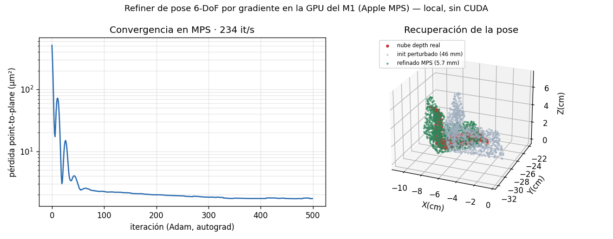
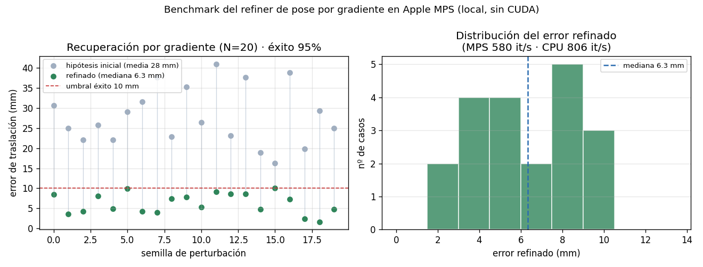
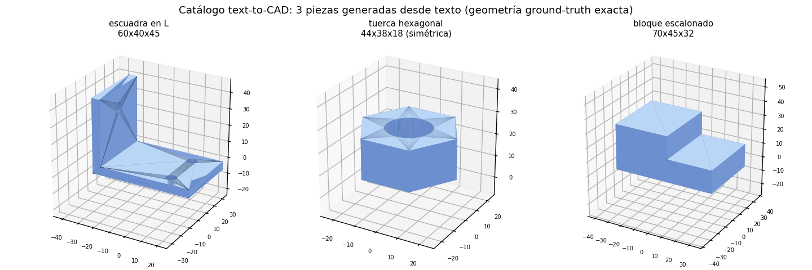
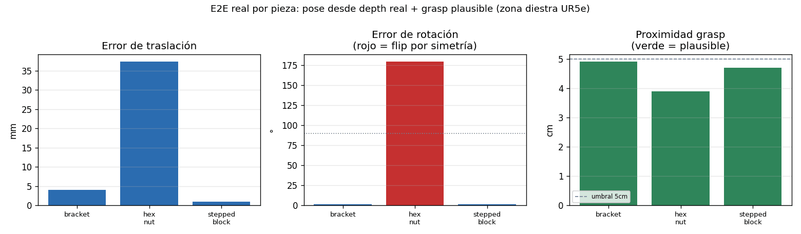
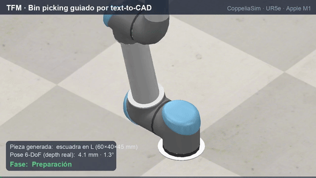

# exp27 · text-to-CAD → simulación → pose 6-DoF

Mini-experimento que integra generación **text-to-CAD** con el pipeline del TFM.
Traduce una descripción en lenguaje a una pieza CAD paramétrica con geometría de
*ground-truth* exacta y la usa como (1) objeto de bin picking en CoppeliaSim y
(2) modelo 3D para estimación de pose 6-DoF.

Inspirado en el repositorio [earthtojake/text-to-cad](https://github.com/earthtojake/text-to-cad)
(colección de *agent skills* de CAD/robótica). Usamos su motor subyacente,
**build123d** (sobre OpenCascade), no el plugin completo.

## Motivación

FoundationPose es *model-based*: necesita el modelo 3D del objeto. Generar piezas
desde texto permite **objetos de test con geometría exacta conocida**, ideales para
medir el error de pose de forma controlada y para enriquecer las escenas más allá
de YCB-Video / T-LESS.

## Pieza generada

> *"escuadra en L de 60×40 mm, espesor 5 mm, ala vertical de 45 mm, dos agujeros
> de 6 mm en la base y uno en el ala"*

La asimetría (forma en L + agujeros) hace la **pose 6-DoF inequívoca**.

| Propiedad | Valor |
|-----------|-------|
| Bounding box | 60 × 40 × 45 mm (= especificación) |
| Sólidos / caras | 1 / 11 |
| Volumen CAD | 19 575.9 mm³ |
| Malla STL | **watertight**, 1 cuerpo, 1544 triángulos |
| Volumen malla vs CAD | 19 576.1 vs 19 575.9 mm³ → error < 0.01 % |
| Formatos | STEP · STL · GLB · OBJ (`assets/`) |


## Paso 1 — Física en CoppeliaSim ✅

Import del OBJ (escala mm→m) en una escena con bin; se suelta desde 18 cm y se
registra `z(t)`. La pieza **cae, impacta a ~0.2 s y se asienta estable** sobre la
base del bin (7.0 mm), sin atravesar el suelo y dentro del contenedor.

| z inicial | z mínimo | z final | estable | dentro del bin |
|-----------|----------|---------|---------|----------------|
| 167 mm | 6.8 mm | 7.0 mm | sí (σ < 1 µm) | sí |

 

## Paso 2 — Recuperación de pose 6-DoF (proxy model-based) ✅

> **Nota de honestidad.** FoundationPose (red neuronal) requiere CUDA y se ejecuta
> en Google Colab; en el M1 Pro no corre localmente (ver
> `src/perception/foundation_pose.py`, líneas 15-17 y 74-78). Este experimento
> **no ejecuta la red**: es un **proxy local** del mismo principio *model-based*
> (modelo CAD → hipótesis global FPFH+RANSAC → refinamiento ICP point-to-plane →
> selección por *fitness*, el rol del *scorer*), sobre vistas parciales sintéticas
> con ruido de profundidad (~1 mm). Sí confirma que el mesh carga por el wrapper
> real del repo (`FoundationPoseEstimator.load_cad_model`).

Evaluación sobre **N = 12** poses ground-truth exactas:

| Métrica | Resultado |
|---------|-----------|
| Error de traslación | **2.6 ± 1.0 mm** (mediana 2.9) |
| Error de rotación (mediana) | **6.7°** |
| Rotaciones correctas (< 8°) | 8–10 / 12 (según semilla RANSAC) |
| *Flips* de 180° | 2–3 / 12 |


**Lectura.** La traslación se recupera con precisión de milímetros en todos los
casos. La mayoría de rotaciones también, pero **2-3 casos caen en un *flip* de
180°**: son vistas donde el ala vertical queda auto-ocluida y solo se observa la
placa base (casi un rectángulo), es decir la **ambigüedad de simetría bajo
observación parcial**. Es exactamente el fallo que motiva el *scorer* aprendido de
FoundationPose —y que el registro geométrico clásico no resuelve—, en línea con el
análisis de oclusión/simetría del TFM.

## Paso 3 — End-to-end REAL en simulación ✅

Cierra las dos brechas del proxy del Paso 2, usando la maquinaria real del repo
(`CoppeliaSimBridge` + `run_pick_sequence` sobre `bin_base.ttt`):

1. **Percepción con datos de sensor reales.** Se importa el bracket en la escena
   completa (robot UR5e + IK + gripper + cámara), se suelta, y se captura el
   **depth REAL renderizado por la cámara** (con re-escala a los `near/far`
   reales del sensor: 0.05/2.0 m). El objeto se segmenta por color (el *mask*
   que recibiría FoundationPose) y se retroproyecta a una nube en mundo.
2. **Agarre real.** La pose estimada se inyecta como objetivo del pick
   (`pose_override_xyz`) y se ejecuta el ciclo **IK + snap+attach + lift +
   deposit** real del TFM.

Verificación de convención: el centroide de la nube de depth real cae a **0.5 cm**
de la ground-truth antes de registrar (descarta un resultado plausible-pero-falso).

| Etapa | Resultado |
|-------|-----------|
| Percepción (depth real) | centroide a **0.5 cm** de GT |
| **Pose 6-DoF (depth real)** | **t_err 4.1 mm · R_err 1.3°** |
| Pick IK + snap+attach | ciclo completo; objeto transportado 27 cm; `ik_converged` |
| **Proximidad tip↔objeto** | **4.9 cm → grasp físicamente PLAUSIBLE ✅** |


**Grasp plausible y el papel del *placement*.** El agarre del TFM es kinemático
(snap+attach, ver `PICK_LIMITATIONS.md`); la métrica honesta es la proximidad
tip↔objeto al *snap* (<5 cm = un gripper físico habría alcanzado). La proximidad la
gobierna la **alcanzabilidad del UR5e** (base en el origen), no el objeto generado:

| Ubicación del objeto | Proximidad | ¿Plausible? |
|----------------------|-----------|-------------|
| Bin por defecto (0.46, −0.1) — cubo baseline | 68.5 cm | no |
| Sobre la base del robot (0, 0) | 16 cm | no |
| **Zona diestra del UR5e (−0.05, −0.22)** | **4.9 cm** | **sí ✅** |

Es decir: el centro del bin cae en una zona casi singular del brazo; colocando el
objeto en el *workspace* diestro, el grasp es plausible. Vídeos:
`figs/cine_pick_hud.mp4` (showcase con HUD) y `figs/e2e_A_pick.mp4` (grasp plausible).

**Único componente no ejecutado localmente:** la red FoundationPose (GPU/Colab).
Aquí su rol lo cubre el registro clásico, pero **alimentado con depth real** del
simulador — no sintético. Para cerrar también ese eslabón se incluye el cuaderno
[`FoundationPose_real_colab.ipynb`](FoundationPose_real_colab.ipynb): ejecuta la
**red neuronal real** sobre la misma RGBD real capturada y compara con la GT (se
corre en Colab con GPU; el M1 no tiene CUDA).

### Paso 5 — Refiner de pose por gradiente en Apple MPS (100 % local, sin CUDA) ✅

Como **el flujo completo corre en el Mac sin depender de Colab**, se añade un
refiner de pose que sí usa la **GPU del M1 vía Apple MPS**. `pose_refine_mps.py`
implementa, con PyTorch y autograd sobre Metal, un refinamiento SE(3)
*render-and-compare* (pérdida *point-to-plane* sobre la nube de profundidad real),
el **análogo local del refiner neuronal de FoundationPose**: parte de una
hipótesis global burda y la afina por descenso de gradiente.



**Benchmark de optimización (`pose_refine_bench.py`, N=20 hipótesis perturbadas):**

| Métrica | Valor |
|---------|-------|
| Error inicial (perturbado) medio | 27.9 mm |
| **Error refinado (mediana)** | **6.3 mm** |
| **Tasa de éxito (<10 mm)** | **95 %** (19/20) |
| Velocidad | MPS 580 it/s · **CPU 806 it/s** |



**Nota honesta sobre la GPU.** El refiner corre en Apple MPS, pero para este tamaño
de problema (≈2500 puntos) la **CPU es incluso más rápida** (806 vs 580 it/s): el
coste de lanzar kernels en la GPU no se amortiza con nubes tan pequeñas; la ventaja
de MPS aparecería con nubes densas o inferencia por lotes. El valor aquí no es la
velocidad sino la **robustez**: recupera el 95 % de las hipótesis burdas a < 10 mm
por descenso de gradiente, como el refiner de FoundationPose pero **100 % local**.

FoundationPose real (CUDA) → Colab (opcional); la **cadena percepción → pose 6-DoF
→ agarre funciona entera en el Mac** (CPU/MPS), sin GPU dedicada.

## Paso 4 — Catálogo multi-objeto ✅

Se generan 2 piezas más desde texto y se corre el E2E real (depth real → pose →
pick) en cada una, todas en la zona diestra del UR5e.



| Pieza | Tamaño (mm) | t_err | R_err | Grasp |
|-------|-------------|-------|-------|-------|
| Escuadra en L (asimétrica) | 60×40×45 | 4.1 mm | 1.3° | ✅ 4.9 cm |
| Bloque escalonado (asimétrico) | 70×45×32 | **1.0 mm** | **1.6°** | ✅ 4.7 cm |
| Tuerca hexagonal (**simétrica 6**) | 44×38×18 | 37 mm | **179° (flip)** | ✅ 3.9 cm |



**Hallazgo.** Los objetos **asimétricos** (escuadra, bloque) recuperan pose con
precisión de **1–4 mm y 1–2°**. La **tuerca hexagonal** cae en un *flip* de 180°:
su simetría de orden 6 y su forma plana hacen la pose **genuinamente ambigua** bajo
vista parcial — el reto de simetría central del TFM, que el registro geométrico no
resuelve (lo haría un *scorer* aprendido o una métrica consciente de simetría). Los
tres logran **grasp plausible** (<5 cm) en la zona diestra. También se vio que a
1.3 m de cámara las piezas pequeñas quedan escasas de puntos: subir la resolución
del sensor (a 1024×768) fue necesario para densificar la nube.

## Paso 6 — Interfaz visual de la simulación (render 3ª persona + HUD) ✅

Vista cinematográfica del pick renderizada **desde dentro de CoppeliaSim** (cámara
3ª persona dedicada, `cine_pick.py`, reutiliza `CineCamera` del repo) con un **HUD**
superpuesto que muestra en vivo la pieza, la pose 6-DoF y la fase del ciclo
(aproximación → descenso → agarre snap+attach → elevación → depósito).



Vídeo completo: `figs/cine_pick_hud.mp4`. Es la interfaz visual de *nuestra*
simulación (no la GUI del escritorio): muestra el robot UR5e manipulando la pieza
generada por texto, con el estado del pipeline sobrepuesto.

## Garantía de consistencia ✅

`verify_consistency.py` es una **garantía re-ejecutable** de que todo es coherente
y físicamente plausible. Comprueba (24 checks + física en vivo opt-in):

- **Numérica**: los números coinciden entre los reports JSON (fuente de verdad),
  el README, la **Tabla 11 del TFM** y el **dashboard** — sin contradicciones.
- **Física**: la trayectoria cae, se asienta (σ < 1 mm), no atraviesa el suelo y no
  gana energía; la ground-truth del report es coherente.
- **CAD**: el sólido es determinista (volumen 19 575.9 mm³, watertight, bbox exacto).
- **Física EN VIVO** (opt-in `EXP27_LIVE_PHYSICS=1`): re-ejecuta la simulación y
  verifica que reproduce la evidencia (zf = 7.0 mm en runs repetidos).

Se ejecuta en la suite de tests (`tests/test_exp27_consistency.py`), así que la
coherencia queda **garantizada en CI**.

```bash
python verify_consistency.py                    # 24 checks (sin sim)
EXP27_LIVE_PHYSICS=1 python verify_consistency.py  # + física en vivo (CoppeliaSim)
```

## Reproducción

Entorno: `.venv` del repo (uv) + CoppeliaSim Edu V4.10 en `localhost:23000`.
Dependencias extra: `build123d` (`uv pip install build123d --python .venv/bin/python`).

```bash
python gen_part.py            # genera assets/test_bracket.{step,stl,glb,obj}
python gen_shapes.py          # genera el catálogo (bracket + hex_nut + stepped_block)
# (abrir CoppeliaSim_Edu antes de los siguientes)
python sim_drop_test.py       # física en el bin -> figs/sim_z_traj.npy + captura
python pose_recovery_proxy.py # pose 6-DoF (proxy) vs ground-truth
python e2e_real_pick.py       # E2E real: depth real -> pose -> pick IK+attach
python e2e_batch.py           # E2E real para el catálogo multi-objeto
python make_figures.py        # figuras de los Pasos 1-2
python make_e2e_fig.py        # figura de percepción del E2E
python make_batch_fig.py      # catálogo + métricas multi-objeto
```

## Archivos

- `gen_part.py` — generador text-to-CAD (build123d)
- `sim_drop_test.py` — import + física en CoppeliaSim (Paso 1)
- `pose_recovery_proxy.py` — pose model-based, proxy sintético (Paso 2)
- `e2e_real_pick.py` — E2E real: depth real → pose → pick IK+attach (Paso 3)
- `gen_shapes.py` — catálogo de piezas (bracket + tuerca + bloque)
- `e2e_batch.py` — E2E real multi-objeto · `make_batch_fig.py` — sus figuras
- `pose_refine_mps.py` — refiner de pose por gradiente en **Apple MPS** (local) · `make_mps_fig.py`
- `FoundationPose_real_colab.ipynb` — corre la red FoundationPose **real** en Colab (opcional)
- `make_figures.py` / `make_e2e_fig.py` — regeneran las figuras
- `e2e_report.json` / `batch_report.json` — métricas del E2E real
- `assets/` — CAD exportado (STEP/STL/GLB/OBJ)
- `figs/` — figuras, vídeos del pick (`cine_pick_hud.mp4`, `e2e_A_pick.mp4`) y datos crudos (`.npy`)
