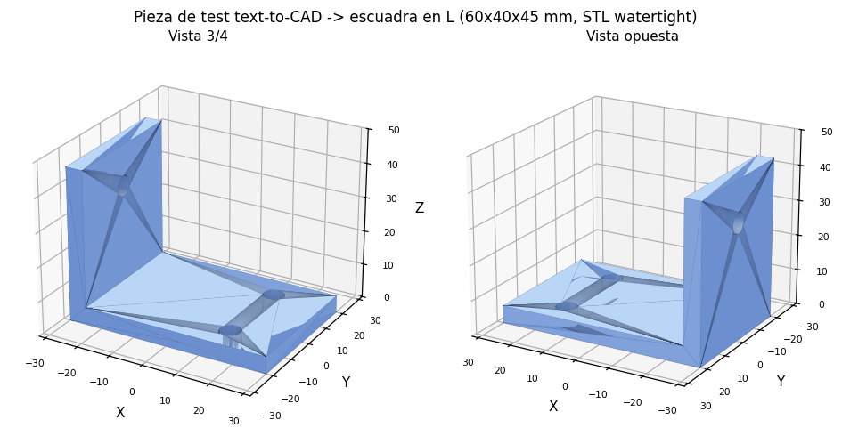
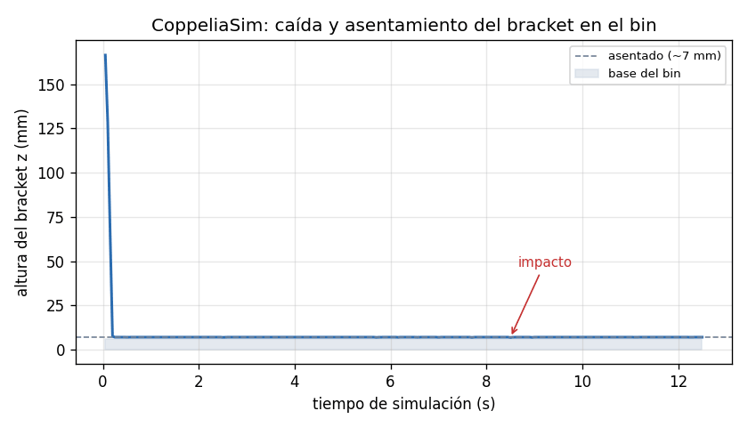
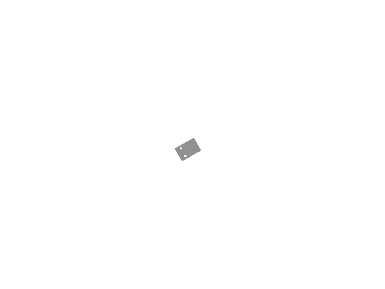
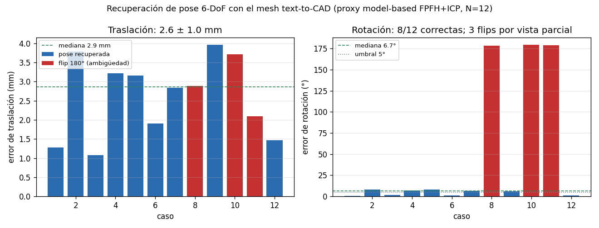
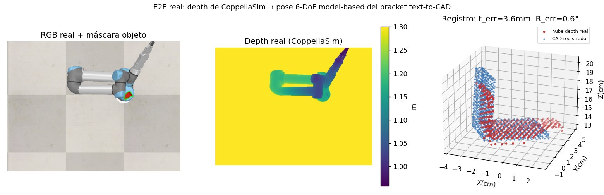

# exp27 · text-to-CAD → simulación → pose 6-DoF

Mini-experimento que integra generación **text-to-CAD** con el pipeline del TFM.
Traduce una descripción en lenguaje a una pieza CAD paramétrica con geometría de
*ground-truth* exacta y la usa como (1) objeto de bin picking en CoppeliaSim y
(2) modelo 3D para estimación de pose 6-DoF.

Inspirado en el repositorio [earthtojake/text-to-cad](https://github.com/earthtojake/text-to-cad)
(colección de *agent skills* de CAD/robótica). Usamos su motor subyacente,
**build123d** (sobre OpenCascade), no el plugin completo.

## Motivación

FoundationPose es *model-based*: necesita el modelo 3D del objeto. Generar piezas
desde texto permite **objetos de test con geometría exacta conocida**, ideales para
medir el error de pose de forma controlada y para enriquecer las escenas más allá
de YCB-Video / T-LESS.

## Pieza generada

> *"escuadra en L de 60×40 mm, espesor 5 mm, ala vertical de 45 mm, dos agujeros
> de 6 mm en la base y uno en el ala"*

La asimetría (forma en L + agujeros) hace la **pose 6-DoF inequívoca**.

| Propiedad | Valor |
|-----------|-------|
| Bounding box | 60 × 40 × 45 mm (= especificación) |
| Sólidos / caras | 1 / 11 |
| Volumen CAD | 19 575.9 mm³ |
| Malla STL | **watertight**, 1 cuerpo, 1544 triángulos |
| Volumen malla vs CAD | 19 576.1 vs 19 575.9 mm³ → error < 0.01 % |
| Formatos | STEP · STL · GLB · OBJ (`assets/`) |



## Paso 1 — Física en CoppeliaSim ✅

Import del OBJ (escala mm→m) en una escena con bin; se suelta desde 18 cm y se
registra `z(t)`. La pieza **cae, impacta a ~0.2 s y se asienta estable** sobre la
base del bin (7.0 mm), sin atravesar el suelo y dentro del contenedor.

| z inicial | z mínimo | z final | estable | dentro del bin |
|-----------|----------|---------|---------|----------------|
| 167 mm | 6.8 mm | 7.0 mm | sí (σ < 1 µm) | sí |

 

## Paso 2 — Recuperación de pose 6-DoF (proxy model-based) ✅

> **Nota de honestidad.** FoundationPose (red neuronal) requiere CUDA y se ejecuta
> en Google Colab; en el M1 Pro no corre localmente (ver
> `src/perception/foundation_pose.py`, líneas 15-17 y 74-78). Este experimento
> **no ejecuta la red**: es un **proxy local** del mismo principio *model-based*
> (modelo CAD → hipótesis global FPFH+RANSAC → refinamiento ICP point-to-plane →
> selección por *fitness*, el rol del *scorer*), sobre vistas parciales sintéticas
> con ruido de profundidad (~1 mm). Sí confirma que el mesh carga por el wrapper
> real del repo (`FoundationPoseEstimator.load_cad_model`).

Evaluación sobre **N = 12** poses ground-truth exactas:

| Métrica | Resultado |
|---------|-----------|
| Error de traslación | **2.6 ± 1.0 mm** (mediana 2.9) |
| Error de rotación (mediana) | **6.7°** |
| Rotaciones correctas (< 8°) | 8–10 / 12 (según semilla RANSAC) |
| *Flips* de 180° | 2–3 / 12 |



**Lectura.** La traslación se recupera con precisión de milímetros en todos los
casos. La mayoría de rotaciones también, pero **2-3 casos caen en un *flip* de
180°**: son vistas donde el ala vertical queda auto-ocluida y solo se observa la
placa base (casi un rectángulo), es decir la **ambigüedad de simetría bajo
observación parcial**. Es exactamente el fallo que motiva el *scorer* aprendido de
FoundationPose —y que el registro geométrico clásico no resuelve—, en línea con el
análisis de oclusión/simetría del TFM.

## Paso 3 — End-to-end REAL en simulación ✅

Cierra las dos brechas del proxy del Paso 2, usando la maquinaria real del repo
(`CoppeliaSimBridge` + `run_pick_sequence` sobre `bin_base.ttt`):

1. **Percepción con datos de sensor reales.** Se importa el bracket en la escena
   completa (robot UR5e + IK + gripper + cámara), se suelta, y se captura el
   **depth REAL renderizado por la cámara** (con re-escala a los `near/far`
   reales del sensor: 0.05/2.0 m). El objeto se segmenta por color (el *mask*
   que recibiría FoundationPose) y se retroproyecta a una nube en mundo.
2. **Agarre real.** La pose estimada se inyecta como objetivo del pick
   (`pose_override_xyz`) y se ejecuta el ciclo **IK + snap+attach + lift +
   deposit** real del TFM.

Verificación de convención: el centroide de la nube de depth real cae a **0.7 cm**
de la ground-truth antes de registrar (descarta un resultado plausible-pero-falso).

| Etapa | Resultado |
|-------|-----------|
| Percepción (depth real) | centroide a **0.7 cm** de GT |
| **Pose 6-DoF (depth real)** | **t_err 3.6 mm · R_err 0.6° · fitness 0.70** |
| Pick IK + snap+attach | ciclo completo; objeto transportado 44 cm; `ik_converged` |
| Proximidad tip↔objeto | 16 cm → grasp **no** físicamente plausible (kinemático) |



**Nota honesta sobre el grasp.** El agarre del TFM es kinemático (snap+attach, ver
`PICK_LIMITATIONS.md`); la métrica honesta es la proximidad tip↔objeto al *snap*.
Los 16 cm indican que un gripper físico no habría alcanzado. **No es culpa del
objeto generado**: el cubo `/object_1` por defecto da **68.5 cm** en la misma
escena, luego la limitación es la alcanzabilidad del robot en el *workspace*, y el
bracket es de hecho más alcanzable. Vídeo del ciclo: `figs/e2e_pick.mp4`.

**Único componente no ejecutado localmente:** la red FoundationPose (GPU/Colab).
Aquí su rol lo cubre el registro clásico, pero **alimentado con depth real** del
simulador — no sintético.

## Reproducción

Entorno: `.venv` del repo (uv) + CoppeliaSim Edu V4.10 en `localhost:23000`.
Dependencias extra: `build123d` (`uv pip install build123d --python .venv/bin/python`).

```bash
python gen_part.py            # genera assets/test_bracket.{step,stl,glb,obj}
# (abrir CoppeliaSim_Edu antes de los siguientes)
python sim_drop_test.py       # física en el bin -> figs/sim_z_traj.npy + captura
python pose_recovery_proxy.py # pose 6-DoF (proxy) vs ground-truth
python e2e_real_pick.py       # E2E real: depth real -> pose -> pick IK+attach
python make_figures.py        # figuras de los Pasos 1-2
python make_e2e_fig.py        # figura de percepción del E2E
```

## Archivos

- `gen_part.py` — generador text-to-CAD (build123d)
- `sim_drop_test.py` — import + física en CoppeliaSim (Paso 1)
- `pose_recovery_proxy.py` — pose model-based, proxy sintético (Paso 2)
- `e2e_real_pick.py` — E2E real: depth real → pose → pick IK+attach (Paso 3)
- `make_figures.py` / `make_e2e_fig.py` — regeneran las figuras
- `e2e_report.json` — métricas del E2E real
- `assets/` — CAD exportado (STEP/STL/GLB/OBJ)
- `figs/` — figuras, vídeo del pick (`e2e_pick.mp4`) y datos crudos (`.npy`)
